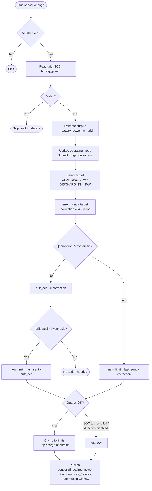
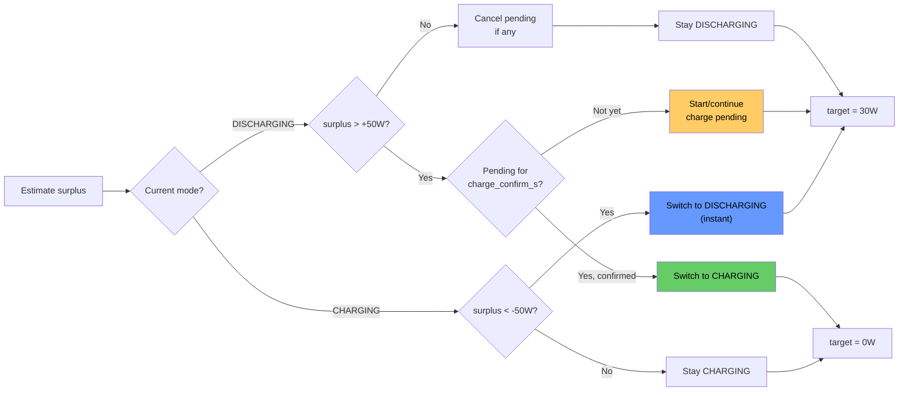

# Controller — `zero_feed_in_controller.py`

Device-agnostic event-driven controller. Reads grid power, SOC, and battery power sensors. Publishes a signed desired-power value that the driver translates into device commands.

---

## Key Concepts

### Solar Surplus Estimation

The controller uses the **actual battery power sensor** (updated every ~4 s by the device) instead of the last commanded value:

```
battery_power_w = battery_power_sensor  (+discharge / -charge)
surplus = -battery_power_w - grid_power_w
```

| Scenario | battery_power_w | grid | surplus |
| --- | --- | --- | --- |
| Charging 500 W, grid +100 W | -500 | +100 | 400 W |
| Discharging 300 W, grid +100 W | +300 | +100 | -400 W |
| Charging 500 W, grid -200 W | -500 | -200 | 700 W |
| Idle, grid -50 W | 0 | -50 | 50 W |

### Operating Mode (Schmitt Trigger with Charge Confirmation)

```
                    surplus > +hysteresis (sustained for charge_confirm_s)
    DISCHARGING ──────────────────────────────────▸ CHARGING
                ◂──────────────────────────────────
                    surplus < -hysteresis (instant)
```

- **DISCHARGING → CHARGING**: Surplus must stay above threshold for `charge_confirm_s` (default 15–20 s). Prevents transient spikes from triggering expensive relay switches.
- **CHARGING → DISCHARGING**: Instant. Cover demand quickly.
- On mode transition: drift accumulator reset to 0.

### Asymmetric Targets

| Mode | Target | Rationale |
| --- | --- | --- |
| DISCHARGING | +30 W | Small grid draw OK as safety buffer |
| CHARGING | 0 W | Absorb all surplus, never pull from grid |

### Surplus Clamp

```python
if raw < 0:  # wants to charge
    max_safe = max(0, surplus)
    clamped = max(raw, -max_charge, -max_safe)
```

### Direction Switches

Optional `input_boolean` entities for HA UI control:

| Switch | When off |
| --- | --- |
| `charge_switch` | Controller idles instead of charging |
| `discharge_switch` | Controller idles instead of discharging |

When any guard forces the controller to idle (direction switches, SOC limits, no-surplus protection), the **drift accumulator is reset to zero**. The accumulator only has meaning in a closed control loop; while the output is blocked, drift becomes stale.

---

## Direct Calculation with Muting

### Core Algorithm

```
error = grid_power - target
correction = ki * error
new_limit = last_sent + correction
```

The `ki` parameter (default 1.0) scales the correction. With `ki=1.0`, the controller applies the full error as correction in one step.

### Muting

After sending a command, the controller **mutes** (ignores) sensor updates for `muting_s` seconds (default 8 s). This prevents reacting to stale data while the device is still executing the previous command. The Zendure SolarFlow has a 10–15 s response latency.

### Hysteresis and Drift Accumulator

- **Large change** (`|correction| > hysteresis`): sent immediately.
- **Small change** (`|correction| <= hysteresis`): accumulated in a drift register. When `|drift_acc| > hysteresis`, a drift correction is sent.

### Event-Driven Updates

The controller reacts to grid sensor state changes (`listen_state`) instead of polling. A safety tick every 30 s detects stale sensors and publishes a safe (0 W) state.

---

## Protection Mechanisms

### SOC Protection

| Condition | Effect |
| --- | --- |
| SOC ≤ effective min_soc | Discharge blocked |
| SOC ≥ max_soc | Charge blocked |

**Dynamic min SOC (forecast-based):** When configured, the controller reads `sensor.zfi_dynamic_min_soc` (published by the PV Forecast Manager). The effective min SOC is clamped to `[Config.min_soc_pct, Config.max_soc_pct]`.

### Grid-Charge Protection

Three layers:
1. **Mode gate**: surplus ≤ 0 → charging blocked
2. **Surplus clamp**: charge capped at available surplus
3. **Asymmetric target**: target = 0 prevents controller from requesting grid power

---

## Flowchart



### Mode Selection



---

## Published HA Sensors

### Always published

| Entity | Type | Unit | Description |
| --- | --- | --- | --- |
| `zfi_desired_power` | number | W | **Main output**: signed desired power (+discharge, -charge) |
| `zfi_mode` | text | — | Operating regime: `charging` or `discharging` |

### Debug only (`debug: true`)

| Entity | Type | Unit | Description |
| --- | --- | --- | --- |
| `zfi_surplus` | number | W | Estimated PV surplus |
| `zfi_battery_power` | number | W | Actual battery power (+discharge, -charge) |
| `zfi_target` | number | W | Active target (0 or 30) |
| `zfi_error` | number | W | Regulation error |
| `zfi_drift_acc` | number | W | Drift accumulator value |
| `zfi_muting` | number | — | 1 if muted, 0 otherwise |
| `zfi_muting_remaining` | number | s | Seconds remaining in muting window |
| `zfi_reason` | text | — | Decision reason |
| `zfi_effective_min_soc` | number | % | Effective min SOC after dynamic clamping |

---

## Code Organization

```
Constants:  UNAVAILABLE_STATES, DEFAULT_SENSOR_PREFIX, CONTROLLER_CSV_COLUMNS

Enums:      OperatingMode (CHARGING, DISCHARGING)

Dataclasses:
  Config          — typed config from apps.yaml
  Measurement     — grid_power_w, soc_pct, battery_power_w, switch states
  ControlOutput   — desired_power_w, reason
  ControllerState — last_sent_w, last_command_t, drift_acc, mode

ControlLogic:     — pure-computation control logic (no HA dependency)
  seed()          — initialise from battery_power_sensor
  compute()       — muting → mode → direct calc → guards → clamp

ZeroFeedInController(hass.Hass): — thin HA adapter
  initialize()    — config, seed, restore state, listen_state
  terminate()     — save state to JSON on shutdown
```

---

## Configuration Reference

See `apps.yaml.example` section 1 (Controller) for all parameters with defaults and comments.
