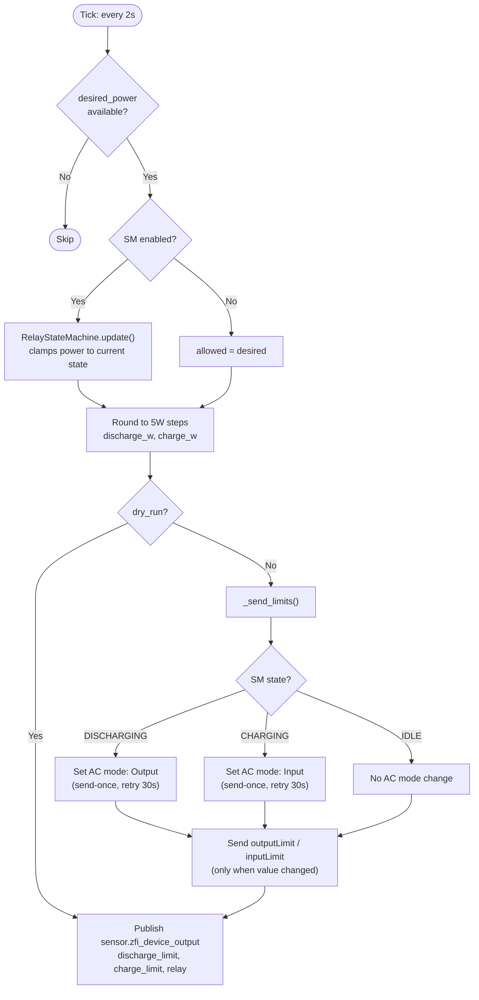

# Driver — `zendure_solarflow_driver.py`

Zendure SolarFlow-specific driver. Reads `sensor.zfi_desired_power` from the controller and translates it into `outputLimit`, `inputLimit`, and `acMode` commands for the SolarFlow 2400 AC+.

---

## Key Concepts

### AC Mode Management

The Zendure SolarFlow requires the correct AC mode before accepting power limits:
- "Input mode" before sending `inputLimit` (charge)
- "Output mode" before sending `outputLimit` (discharge)

The driver sends the AC mode command **once** on intent change, then waits for the device. It does NOT spam the command every tick — the MQTT integration overwrites the entity with device reports faster than the relay physically switches (10–15 s).

Re-send after 30 s if the intent persists (`AC_MODE_RETRY_S`).

### Power Limits

Power limits (outputLimit, inputLimit) are sent whenever their values change. No gating on device mode confirmation — the device is responsible for applying limits in the correct mode.

### Relay Lockout (Adaptive Energy Integrator)

The `RelayStateMachine` gates relay transitions behind an energy integrator (`AdaptiveLockout`). Each tick accumulates `|power| × dt`; the transition fires when the accumulated energy reaches the threshold.

```
threshold = relay_lockout_ws   (e.g. 10000 W·s)
```

For sustained constant power the effective lockout is:

| |desired_power| | Lockout (ws=10000, cutoff=45W) | Rationale |
| --- | --- | --- |
| 400 W+ | ~25 s | High surplus — worth switching |
| 200 W | ~50 s | Moderate — wait longer |
| 100 W | ~100 s | Marginal — probably not worth the relay wear |
| <45 W | ~222 s (cutoff floor) | Negligible — delay rather than switch |

**IDLE transitions** use an accumulated-time lockout (`idle_lockout_s`): time counted only during ticks where IDLE is the target.

**Independent accumulators:** Each non-current state tracks its own transition progress independently. Switching between two non-current targets does **not** reset the other's accumulator.

During lockout, power is **clamped** to the current direction's minimum active power (`min_active_power_w`), keeping the device responsive while preventing relay chatter.

### Rounding and Suppression

- Power rounded to 5 W steps (`ROUNDING_STEP_W`)
- Redundant sends suppressed (only send when values change)

---

## Flowchart



---

## Published HA Sensors

### Always published

| Entity | Type | Unit | Description |
| --- | --- | --- | --- |
| `zfi_device_output` | number | W | Signed power sent to device |
| `zfi_discharge_limit` | number | W | outputLimit sent (≥ 0) |
| `zfi_charge_limit` | number | W | inputLimit sent (≥ 0) |
| `zfi_relay` | text | — | Physical relay state from AC mode entity |
| `zfi_relay_locked` | text | — | `true` when SM is clamping output |

### Debug only (`debug: true`)

| Entity | Type | Unit | Description |
| --- | --- | --- | --- |
| `zfi_relay_sm_state` | text | — | Current SM state (idle/charging/discharging) |
| `zfi_relay_sm_pending` | text | — | Pending transition target (or "none") |
| `zfi_relay_sm_lockout_pct` | number | % | Unified lockout progress for active transition |
| `zfi_relay_sm_accumulated_ws` | number | W·s | Accumulated energy toward transition threshold |
| `zfi_relay_sm_threshold_ws` | number | W·s | Energy threshold required for transition |
| `zfi_relay_sm_charge_pct` | number | % | Charge transition progress |
| `zfi_relay_sm_discharge_pct` | number | % | Discharge transition progress |
| `zfi_relay_sm_idle_pct` | number | % | Idle transition progress |

---

## Code Organization

```
Constants:  DIRECTION_THRESHOLD_W, ROUNDING_STEP_W, AC_MODE_*,
            AC_MODE_RETRY_S, RELAY_SAFETY_TIMEOUT_S, MIN_ACTIVE_POWER_W

Enums:      RelayDirection (CHARGE, IDLE, DISCHARGE)
            RelayState     (IDLE, CHARGING, DISCHARGING)

Dataclasses:
  AdaptiveLockout — energy integrator for relay lockout (pure computation)
  Config          — desired_power_sensor, device entities, lockout settings
  DriverState     — last_sent limits, relay tracking

RelayStateMachine:  — guards relay transitions (pure computation)
  seed()            — set initial state from device
  update()          — process desired power, return allowed power

ZendureSolarFlowDriver(_HASS_BASE):
  initialize()      — config, seed, restore state, schedule (2 s interval)
  terminate()       — save state to JSON on shutdown
```

---

## Configuration Reference

See `apps.yaml.example` section 3 (Driver) for all parameters with defaults and comments.
