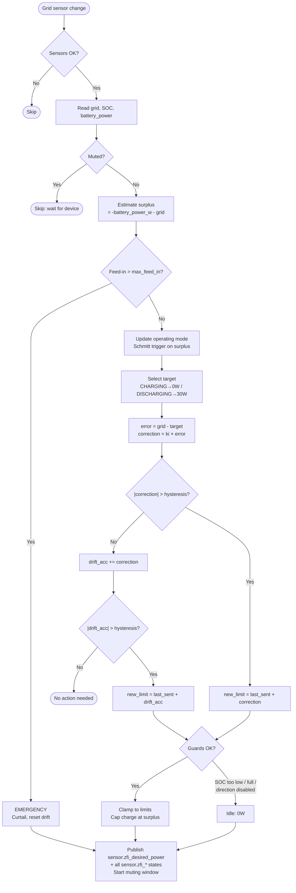
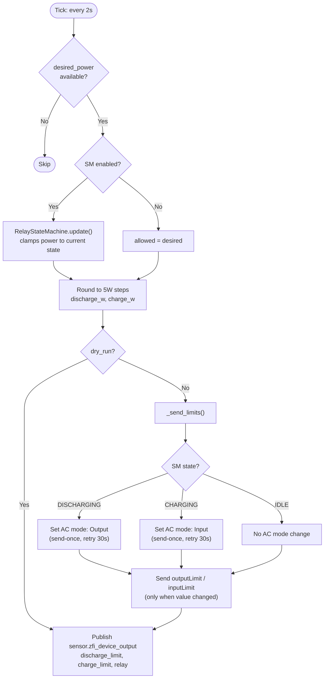
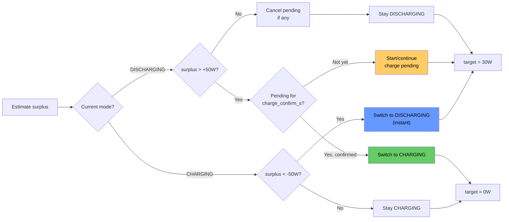

# Zero Feed-In — Documentation

## Overview

Two AppDaemon apps for the Zendure SolarFlow 2400 AC+ that keep the grid meter at ~0 W:

1. **Controller** (`zero_feed_in_controller.py`) — Device-agnostic event-based controller. Reads grid power, SOC, and battery power sensors. Publishes a signed desired-power value.
2. **Driver** (`zendure_solarflow_driver.py`) — Zendure-specific driver. Reads the desired power and translates it into `outputLimit`, `inputLimit`, and `acMode` commands.

- **Solar surplus** → charge battery (absorb excess PV)
- **Solar deficit** → discharge battery (cover house demand)
- **No surplus** → **never** charge from grid

---

## System Architecture

```
┌──────────────┐                     ┌───────────────┐
│  Existing PV │───── AC ──────────▸ │   House Grid  │
│  System      │  (solar power)      │               │
└──────────────┘                     │  ┌─────────┐  │
                                     │  │  Loads  │  │
┌──────────────┐    MQTT (W)         │  └─────────┘  │
│  EDL21 IR    │───────────────────▸ │               │
│  Reader      │                     │               │◂──── Utility Grid
└──────────────┘                     └───────┬───────┘
       │                                     │ AC
       ▼                                     │
┌──────────────────────────┐        ┌────────┴────────┐
│  Home Assistant          │  MQTT  │  SolarFlow      │
│  ┌────────────────────┐  │◂─────▸│  2400 AC+       │
│  │  AppDaemon         │  │       │                  │
│  │  ┌──────────────┐  │  │       │  setOutputLimit  │
│  │  │  Controller   │──┤──┤──────▸│  setInputLimit   │
│  │  │  (PI)        │  │  │       │  acMode          │
│  │  └──────┬───────┘  │  │       └──────────────────┘
│  │         │desired_W  │  │
│  │  ┌──────▼───────┐  │  │
│  │  │  Driver      │──┘  │
│  │  │  (Zendure)   │     │
│  │  └──────────────┘     │
│  │                       │
│  │  sensor.zfi_*         │
│  │  (published states)   │
│  └───────────────────────┘
└──────────────────────────┘
```

### Data flow

```
Controller (event-driven, reacts to grid sensor changes):
  grid_power_sensor ─────────┐
  soc_sensor ────────────────┤──▸ direct calc ──▸ sensor.zfi_desired_power
  battery_power_sensor───────┤                    sensor.zfi_mode, surplus, etc.
  dynamic_min_soc_entity ────┘                    (forecast-adjusted min SOC)

Driver (every 2s):
  sensor.zfi_desired_power ──▸ AC mode + outputLimit + inputLimit
                                sensor.zfi_device_output, relay, etc.
```

### Why two apps?

| Concern | Controller | Driver |
| --- | --- | --- |
| What it knows | Grid power, SOC, surplus | Device protocol, relay timing |
| What it doesn't know | outputLimit, inputLimit, acMode | ki, targets, modes |
| Reusable for | Any battery | Only Zendure SolarFlow |
| Update rate | Event-driven (grid sensor) | 2 s (react to new desired power) |

---

## Controller: Key Concepts

### 1. Solar Surplus Estimation

The controller uses the **actual battery power sensor** (updated every ~4 s by the device) instead of the last commanded value:

```
battery_power_sensor: +positive = discharge, -negative = charge
controller convention: +positive = discharge, -negative = charge (same)

battery_power_w = battery_power_sensor  (no negation)

surplus = -battery_power_w - grid_power_w
        = -(actual battery) - grid
```

This is more accurate than the old `last_sent_w` approach because it reflects what the device is actually doing, not what was commanded. Particularly important during the 10-15 s device response lag.

| Scenario | battery_power_w | grid | surplus |
| --- | --- | --- | --- |
| Charging 500 W, grid +100 W | -500 | +100 | 400 W |
| Discharging 300 W, grid +100 W | +300 | +100 | -400 W |
| Charging 500 W, grid -200 W | -500 | -200 | 700 W |
| Idle, grid -50 W | 0 | -50 | 50 W |

### 2. Operating Mode (Schmitt Trigger with Charge Confirmation)

```
                    surplus > +hysteresis (sustained for charge_confirm_s)
    DISCHARGING ──────────────────────────────────▸ CHARGING
                ◂──────────────────────────────────
                    surplus < -hysteresis (instant)
```

- **DISCHARGING → CHARGING**: Surplus must stay above threshold for `charge_confirm_s` (default 15–20 s). Prevents transient spikes from triggering expensive relay switches.
- **CHARGING → DISCHARGING**: Instant. Cover demand quickly.
- On mode transition: drift accumulator reset to 0.

### 3. Asymmetric Targets

| Mode | Target | Rationale |
| --- | --- | --- |
| DISCHARGING | +30 W | Small grid draw OK as safety buffer |
| CHARGING | 0 W | Absorb all surplus, never pull from grid |

### 4. Surplus Clamp

```python
if raw < 0:  # wants to charge
    max_safe = max(0, surplus)
    clamped = max(raw, -max_charge, -max_safe)
```

### 5. Direction Switches

Optional `input_boolean` entities for HA UI control:

| Switch | When off |
| --- | --- |
| `charge_switch` | Controller idles instead of charging |
| `discharge_switch` | Controller idles instead of discharging |

When any guard forces the controller to idle (direction switches, SOC limits,
no-surplus protection), the **drift accumulator is reset to zero**.  The
accumulator only has meaning in a closed control loop; while the output is
blocked (loop open), there is no feedback, so the accumulated drift becomes
stale.  Resetting ensures the controller starts fresh when the guard clears.

---

## Controller: Direct Calculation with Muting

### Core Algorithm

The controller uses direct calculation instead of PI control:

```
error = grid_power - target
correction = ki * error
new_limit = last_sent + correction
```

The `ki` parameter (default 1.0) scales the correction. With `ki=1.0`, the controller
applies the full error as correction in one step. Lower values (e.g. 0.5) produce
more conservative, slower corrections.

### Muting

After sending a command, the controller **mutes** (ignores) sensor updates for
`muting_s` seconds (default 8 s). This prevents reacting to stale data while the
device is still executing the previous command. The Zendure SolarFlow has a 10-15 s
response latency, so the muting window avoids oscillation from stale readings.

### Hysteresis and Drift Accumulator

Changes are classified as **large** or **small** based on the `hysteresis_w`
threshold (default 15 W):

- **Large change** (`|correction| > hysteresis`): sent immediately.
- **Small change** (`|correction| <= hysteresis`): accumulated in a drift register.
  When `|drift_acc| > hysteresis`, a drift correction is sent.

This avoids sending frequent tiny adjustments while still correcting persistent
small errors over time.

### Event-Driven Updates

The controller reacts to grid sensor state changes (`listen_state`) instead of
polling on a fixed interval. This means:
- Faster response to sudden load changes
- No wasted cycles when the grid sensor hasn't changed
- A safety tick every 30 s detects stale sensors and publishes a safe (0 W) state

---

## Driver: Key Concepts

### 1. AC Mode Management

The Zendure SolarFlow requires the correct AC mode before accepting power limits:
- "Input mode" before sending `inputLimit` (charge)
- "Output mode" before sending `outputLimit` (discharge)

The driver sends the AC mode command **once** on intent change, then waits for the device. It does NOT spam the command every tick — the MQTT integration overwrites the entity with device reports faster than the relay physically switches (10-15 s).

Re-send after 30 s if the intent persists (`AC_MODE_RETRY_S`).

### 2. Power Limits

Power limits (outputLimit, inputLimit) are sent whenever their values change. No gating on device mode confirmation — the device is responsible for applying limits in the correct mode.

### 3. Relay Lockout (adaptive, energy-integrator)

The `RelayStateMachine` gates relay transitions behind an energy integrator (`AdaptiveLockout`).  Each tick accumulates `|power| × dt`; the transition fires when the accumulated energy reaches `full_power_w × base_lockout_s`.

```
threshold = full_power_w × base_lockout_s   (e.g. 200 W × 30 s = 6 000 W·s)
```

For sustained constant power the effective lockout is:

| |desired_power| | Lockout (base=30s, ref=200W) | Rationale |
| --- | --- | --- |
| 200 W+ | 30 s | High surplus — worth switching |
| 100 W | 60 s | Moderate — wait longer |
| 50 W | 120 s | Marginal — probably not worth the relay wear |
| <20 W | ≥300 s (safety cap) | Negligible — idle instead |

IDLE transitions use an accumulated-time lockout (`idle_lockout_s`): time is only counted during ticks where IDLE is the target, so oscillations between non-current states accumulate IDLE time across interruptions.

**Independent accumulators:** Each non-current state tracks its own transition progress independently. Switching between two non-current targets (e.g. oscillating between IDLE and DISCHARGE while in CHARGING) does **not** reset the other's accumulator. This ensures that even with oscillating desired power, the state machine eventually transitions — whichever accumulator reaches its threshold first wins. All accumulators are reset only when the desired state matches the current state (stable) or when an actual transition fires.

A 300 s safety timeout (`RELAY_SAFETY_TIMEOUT_S`) forces the transition if the integrator hasn't reached threshold (e.g. very low power).

During lockout, power is **clamped** to the current direction's minimum active power (`min_active_power_w`, code default 25 W, configurable via `apps.yaml`), keeping the device responsive while preventing relay chatter.

### 4. Rounding and Suppression

- Power rounded to 5 W steps (`ROUNDING_STEP_W`)
- Redundant sends suppressed (only send when values change)

---

## Protection Mechanisms

### 1. Emergency (Feed-in > `max_feed_in`)

Direct curtailment: output reduced by (excess + 50 W margin). Drift accumulator reset.

### 2. Direction Lockout (adaptive, direction-aware)

... gates transitions behind an energy integrator (`AdaptiveLockout`): each tick accumulates `|power| × dt` until the threshold (`full_power_w × base_lockout_s`) is reached. High power → short lockout; low power → long lockout. Each non-current state tracks its own accumulator independently — switching between two non-current targets does not reset the other's progress. A 300 s safety timeout prevents infinite lockout. During lockout: power clamped to the current direction's minimum active power (`min_active_power_w`), keeping the device responsive.

### 3. SOC Protection

| Condition | Effect |
| --- | --- |
| SOC ≤ effective min_soc | Discharge blocked |
| SOC ≥ max_soc | Charge blocked |

**Dynamic min SOC (forecast-based):** When `dynamic_min_soc_entity` is configured (default: `sensor.zfi_dynamic_min_soc`, published by the PV Forecast Manager app), the controller reads it every cycle. The effective min SOC is clamped to `[Config.min_soc_pct, Config.max_soc_pct]` so it can never violate the hard limits from `apps.yaml`. When the entity is unavailable, the static `min_soc_pct` applies.

The PV Forecast Manager (`pv_forecast_manager.py`) evaluates at 06:00, 15:00, and 20:00. If the PV forecast for tomorrow (summed across all configured Forecast.Solar entities) is below 1.5 kWh:
- **06:00 (morning)**: sets `sensor.zfi_dynamic_min_soc` to **50%** — prevents daytime discharge when PV won't recharge.
- **15:00 / 20:00 (evening)**: sets it to **30%** — preserves a night buffer.

Otherwise resets to 10%. This prevents pointless deep discharge on days when PV won't deliver enough to recharge.

### 4. Grid-Charge Protection

Three layers:
1. **Mode gate**: surplus ≤ 0 → charging blocked
2. **Surplus clamp**: charge capped at available surplus
3. **Asymmetric target**: target = 0 prevents controller from requesting grid power

---

## Architecture & Design Decisions

### Why two apps (controller + driver)?

- **Controller** handles direct calculation control, mode switching, surplus estimation — reusable for any battery
- **Driver** handles Zendure-specific protocol: AC mode relay, power rounding, lockout timing
- Controller publishes `sensor.zfi_desired_power` (signed W, +discharge/-charge)
- Driver polls this sensor every 2 s and translates to device commands
- Separation allows swapping the driver for other batteries without touching control logic

### Why AppDaemon (not HA Blueprint)?

- Controller with state, mode machine, guards, and lockouts doesn't fit YAML templates
- AppDaemon gives real Python: dataclasses, enums, testable methods, proper logging

### Why two actuators (not one)?

- `setOutputLimit`: discharge power (W), feeds into house
- `setInputLimit`: AC charge power (W), charges battery
- `acMode`: select entity, must be "Input mode" before charging, "Output mode" before discharging
- All MQTT entities, actuators are write-only from the driver's perspective
- `setDeviceAutomationInOutLimit` exists (single bidirectional entity) but availability depends on firmware

### Why sensors are read-only, actuators write-only

- Number entities show *commanded* value, not actual output
- PI uses its own state (`last_sent_w`), surplus uses `battery_power_sensor`
- Only external sensors needed by controller: `grid_power`, `soc`, `battery_power`

### AC Mode Management in Driver

- Zendure MQTT integration overwrites the AC mode entity with device reports faster than the physical relay switches (10-15 s)
- Cannot use entity state to suppress redundant sends — it always shows old mode
- Driver tracks its own intent (`last_set_relay`) and only re-sends after 30 s timeout
- Relay lockout uses driver's intent tracking, not entity state
- Power limits (outputLimit, inputLimit) are always sent when values change — no gating on device mode confirmation

### Key Design Principles

1. **Controller knows nothing about hardware.** All device specifics live in the driver. Controller outputs a signed watt value.
2. **ControlLogic has no HA imports.** Testable with plain dataclasses. The HA adapter is a thin wrapper.
3. **Surplus estimation uses measured battery power**, not reconstructed from last command. Eliminates dry-run drift and device lag issues.
4. **"Never charge from grid" is a guard, not a mode.** Surplus ≤ 0 → charge blocked.
5. **Relay protection lives in the driver.** The controller can freely request any power level. The driver's state machine decides when and how to execute it.
6. **Forecast is conservative, not optimizing.** One threshold (1.5 kWh) switches between two min_soc values (10% / 30%). No complex optimization.
7. **Muting replaces complex anti-windup.** Instead of integral anti-windup, the controller simply ignores sensor updates while the device is responding. Simpler and more robust.

---

## File Structure

```
src/
├── zero_feed_in_controller.py    # device-agnostic direct calculation controller
├── zendure_solarflow_driver.py   # Zendure SolarFlow driver
├── pv_forecast_manager.py        # PV forecast → dynamic min SOC
├── relay_switch_counter.py       # relay switch event counter (persists to JSON)
├── csv_logger.py                 # shared daily-rotating CSV file logger
└── solarflow_mqtt_watchdog.py    # MQTT reconnect watchdog (HTTP API trigger)
run/                              # runtime state (git-ignored, auto-created)
├── zfi_controller_state.json
├── zfi_driver_state.json
└── relay_switch_count.json
config/
├── apps.yaml.example             # documented configuration template
├── apps.yaml                      # your configuration (git-ignored)
├── secrets.yaml.example          # template for device credentials
└── lovelace_*.yaml               # Lovelace dashboard YAML files
tests/
└── test_*.py                     # 274 unit tests covering all modules
docs/
├── zero_feed_in_docs.md          # this file (comprehensive technical doc)
└── DASHBOARDS.md                 # Lovelace dashboard setup guide
```

---

## Code Organization

### Controller (`src/zero_feed_in_controller.py`)

```
Constants:  UNAVAILABLE_STATES, DEFAULT_SENSOR_PREFIX, EMERGENCY_SAFETY_MARGIN_W,
            CONTROLLER_CSV_COLUMNS

Enums:      OperatingMode (CHARGING, DISCHARGING)

Dataclasses:
  Config          — typed config from apps.yaml (ki, hysteresis, muting, targets, limits)
  Measurement     — grid_power_w, soc_pct, battery_power_w, switch states, dynamic_min_soc_pct
  ControlOutput   — desired_power_w, reason
  ControllerState — last_sent_w, last_command_t, current_muting_s, drift_acc, mode, charge_pending_since

ControlLogic:     — pure-computation control logic (no HA dependency)
  seed()                        — initialise from battery_power_sensor
  compute()                     — muting → emergency → mode → direct calc → guards → clamp
  state_snapshot()              — return dict of last_sent/mode/drift_acc/surplus_ema
  restore_from_snapshot()       — restore state from dict (returns bool)

ZeroFeedInController(hass.Hass): — thin HA adapter
  initialize()                  — config, seed, restore state, CsvLogger, listen_state
  terminate()                   — save state to JSON on shutdown
  _on_grid_change()             — event callback: read → compute → log → publish → csv → save
  _safety_tick()                — periodic stale sensor check (30 s)
```

### Driver (`src/zendure_solarflow_driver.py`)

```
Constants:  DIRECTION_THRESHOLD_W, ROUNDING_STEP_W, AC_MODE_*,
            AC_MODE_RETRY_S, RELAY_SAFETY_TIMEOUT_S, MIN_ACTIVE_POWER_W

Enums:      RelayDirection (CHARGE, IDLE, DISCHARGE)
            RelayState     (IDLE, CHARGING, DISCHARGING)

Dataclasses:
  AdaptiveLockout — energy integrator for relay lockout (pure computation)
  Config          — desired_power_sensor, device entities, lockout settings
  DriverState     — last_sent limits, relay tracking

RelayStateMachine:  — guards relay transitions (pure computation)
  seed()            — set initial state from device
  update()          — process desired power, return allowed power
  state_snapshot()  — return dict of SM state
  restore_from_snapshot() — restore SM state from dict (returns bool)

ZendureSolarFlowDriver(_HASS_BASE):
  initialize()              — config, seed, restore state, schedule (2 s interval)
  terminate()               — save state to JSON on shutdown
  _on_tick()                — read desired → SM update → round → send → save on transition
  _send_limits()            — AC mode + power limits
```

---

## Testing

### Test Coverage

221 unit tests covering:
- **Controller** (42 tests): ControlLogic, direct calculation, muting, drift, guards, state persistence
- **Driver** (128 tests): RelayStateMachine, AdaptiveLockout, command sequencing
- **PV Forecast** (17 tests): sensor reading, dynamic min SOC logic
- **CSV Logger** (8 tests): file rotation, CSV formatting
- **MQTT Watchdog** (18 tests): heartbeat monitoring, safe state logic

All tests pass. Run with:
```bash
pytest tests/
```

### Testing Approach

1. **Dry run** (`dry_run: true`): controller computes, publishes sensors, logs — sends nothing. SOC can be faked via `input_number`. Grid sensor should be real.
2. **Manual output**: set SolarFlow output manually while dry run is active. Controller sees real physics and shows what it would do.
3. **Ramp up**: `dry_run: false`, start with `max_output: 200`, increase over days.
4. **Monitor**: `sensor.zfi_*` entities in HA history graphs.

---

## Measured Device Timing

Relay closed, step response settle times:

| Quadrant | Physical action | T1 (s) |
|---|---|---|
| discharge_up | increase discharge | 5.0 |
| discharge_down | decrease discharge | 3.5 |
| charge_up | increase charge | 7.5 |
| charge_down | decrease charge | 5.5 |

Relay switching:
- Charge relay on: 8s, off: 1s
- Discharge relay on: 3-6s, off: 4s

**Key finding**: no slew rate behavior. Settle time does not scale with step size. The device has a processing delay, not a ramp limit.

---

## Flowcharts

### Main Control Loop (Controller)



### Driver Loop



### Mode Selection



---

## Published HA Sensors

### Controller sensors (always published)

| Entity | Type | Unit | Description |
| --- | --- | --- | --- |
| `zfi_desired_power` | number | W | **Main output**: signed desired power (+discharge, -charge) |
| `zfi_mode` | text | — | Operating regime: `charging` or `discharging` |

### Controller sensors (debug only)

Published only when `debug: true` in the controller config.

| Entity | Type | Unit | Description |
| --- | --- | --- | --- |
| `zfi_surplus` | number | W | Estimated PV surplus |
| `zfi_battery_power` | number | W | Actual battery power (+discharge, -charge) |
| `zfi_target` | number | W | Active target (0 or 30) |
| `zfi_error` | number | W | Regulation error |
| `zfi_drift_acc` | number | W | Drift accumulator value |
| `zfi_muting` | number | — | 1 if muted, 0 otherwise |
| `zfi_muting_remaining` | number | s | Seconds remaining in muting window |
| `zfi_reason` | text | — | Decision reason |
| `zfi_effective_min_soc` | number | % | Effective min SOC after dynamic clamping |

### Driver sensors (always published)

| Entity | Type | Unit | Description |
| --- | --- | --- | --- |
| `zfi_device_output` | number | W | Signed power sent to device |
| `zfi_discharge_limit` | number | W | outputLimit sent (≥ 0) |
| `zfi_charge_limit` | number | W | inputLimit sent (≥ 0) |
| `zfi_relay` | text | — | Physical relay state from AC mode entity |
| `zfi_relay_locked` | text | — | `true` when SM is clamping output or relay is physically switching (8 s holdoff) |

### Driver sensors (debug only)

Published only when `debug: true` in the driver config.

| Entity | Type | Unit | Description |
| --- | --- | --- | --- |
| `zfi_relay_sm_state` | text | — | Current SM state (idle/charging/discharging) |
| `zfi_relay_sm_pending` | text | — | Pending transition target (or "none") |
| `zfi_relay_sm_lockout_pct` | number | % | Unified lockout progress for active transition |
| `zfi_relay_sm_accumulated_ws` | number | W·s | Accumulated energy toward transition threshold |
| `zfi_relay_sm_threshold_ws` | number | W·s | Energy threshold required for transition |
| `zfi_relay_sm_charge_pct` | number | % | Charge transition progress |
| `zfi_relay_sm_discharge_pct` | number | % | Discharge transition progress |
| `zfi_relay_sm_idle_pct` | number | % | Idle transition progress |

---

## Debug Dashboards

### Full Debug Dashboard

Shows all controller and driver states for troubleshooting. Copy to a manual HA dashboard card (YAML mode):

```yaml
type: vertical-stack
cards:
  # ── Power overview ──────────────────────────────
  - type: history-graph
    title: Power & Control
    hours_to_show: 0.5
    entities:
      - entity: sensor.smart_meter_sum_active_instantaneous_power
        name: Grid Power
      - entity: sensor.zfi_desired_power
        name: Desired Power
      - entity: sensor.zfi_device_output
        name: Device Output
      - entity: sensor.zfi_surplus
        name: Surplus
      - entity: sensor.zfi_battery_power
        name: Battery Power

  # ── Device commands ─────────────────────────────
  - type: history-graph
    title: Device Commands
    hours_to_show: 0.5
    entities:
      - entity: sensor.zfi_discharge_limit
        name: Discharge Limit
      - entity: sensor.zfi_charge_limit
        name: Charge Limit

  # ── Controller internals ─────────────────────────
  - type: history-graph
    title: Controller Internals
    hours_to_show: 0.5
    entities:
      - entity: sensor.zfi_error
        name: Error
      - entity: sensor.zfi_drift_acc
        name: Drift Acc
      - entity: sensor.zfi_muting_remaining
        name: Muting Remaining
      - entity: sensor.zfi_target
        name: Target

  # ── Battery ─────────────────────────────────────
  - type: history-graph
    title: Battery
    hours_to_show: 0.5
    entities:
      - entity: sensor.hec4nencn492140_electriclevel
        name: SOC %

  # ── Relay state machine ─────────────────────────
  - type: history-graph
    title: Relay State Machine
    hours_to_show: 0.5
    entities:
      - entity: sensor.zfi_relay_sm_lockout_pct
        name: Lockout Progress %
      - entity: sensor.zfi_relay_sm_accumulated_ws
        name: Accumulated (W·s)
      - entity: sensor.zfi_relay_sm_threshold_ws
        name: Threshold (W·s)

  # ── Current state (entities card) ───────────────
  - type: entities
    title: ZFI Status
    entities:
      - entity: sensor.zfi_desired_power
        name: Desired Power
      - entity: sensor.zfi_device_output
        name: Device Output
      - entity: sensor.zfi_mode
        name: Mode
      - entity: sensor.zfi_relay
        name: Relay
      - entity: sensor.zfi_relay_locked
        name: Relay Locked
      - entity: sensor.zfi_surplus
        name: Surplus
      - entity: sensor.zfi_battery_power
        name: Battery Power
      - entity: sensor.zfi_target
        name: Target
      - entity: sensor.zfi_error
        name: Error
      - entity: sensor.zfi_drift_acc
        name: Drift Acc
      - entity: sensor.zfi_muting_remaining
        name: Muting Remaining
      - entity: sensor.zfi_discharge_limit
        name: Discharge Limit
      - entity: sensor.zfi_charge_limit
        name: Charge Limit
      - entity: sensor.zfi_reason
        name: Reason
      - type: divider
      - entity: sensor.zfi_relay_sm_state
        name: SM State
      - entity: sensor.zfi_relay_sm_pending
        name: SM Pending
      - entity: sensor.zfi_relay_sm_lockout_pct
        name: SM Lockout %
      - entity: sensor.zfi_relay_sm_accumulated_ws
        name: SM Accumulated (W·s)
      - entity: sensor.zfi_relay_sm_threshold_ws
        name: SM Threshold (W·s)
      - type: divider
      - entity: select.hec4nencn492140_acmode
        name: AC Mode (device)
      - entity: number.hec4nencn492140_outputlimit
        name: outputLimit (device)
      - entity: number.hec4nencn492140_inputlimit
        name: inputLimit (device)
      - entity: sensor.hec4nencn492140_electriclevel
        name: SOC (device)
      - type: divider
      - entity: input_boolean.zfi_charge_enabled
        name: Charge Enabled
      - entity: input_boolean.zfi_discharge_enabled
        name: Discharge Enabled
```

### Compact Overview Dashboard

For daily monitoring (not debugging):

```yaml
type: vertical-stack
cards:
  - type: history-graph
    title: Zero Feed-In
    hours_to_show: 0.5
    entities:
      - entity: sensor.smart_meter_sum_active_instantaneous_power
        name: Grid
      - entity: sensor.zfi_surplus
        name: Surplus
      - entity: sensor.zfi_desired_power
        name: Desired
      - entity: sensor.zfi_device_output
        name: Output

  - type: entities
    title: Status
    entities:
      - entity: sensor.zfi_mode
      - entity: sensor.zfi_reason
      - entity: sensor.zfi_relay_locked
        name: Relay Locked
      - entity: sensor.hec4nencn492140_electriclevel
        name: SOC
      - entity: input_boolean.zfi_charge_enabled
      - entity: input_boolean.zfi_discharge_enabled
```

### Relay State Machine Debug Dashboard

For diagnosing relay transitions and adaptive lockout behaviour:

```yaml
type: vertical-stack
cards:
  # ── Lockout energy integrator over time ─────────
  - type: history-graph
    title: Adaptive Lockout Progress
    hours_to_show: 0.5
    entities:
      - entity: sensor.zfi_relay_sm_lockout_pct
        name: Lockout %
      - entity: sensor.zfi_relay_sm_accumulated_ws
        name: Accumulated (W·s)
      - entity: sensor.zfi_relay_sm_threshold_ws
        name: Threshold (W·s)

  # ── Per-direction progress (independent accumulators) ─
  - type: history-graph
    title: Direction Progress (independent)
    hours_to_show: 0.5
    entities:
      - entity: sensor.zfi_relay_sm_charge_pct
        name: Charge %
      - entity: sensor.zfi_relay_sm_discharge_pct
        name: Discharge %
      - entity: sensor.zfi_relay_sm_idle_pct
        name: Idle %

  # ── AC mode & power context ────────────────────
  - type: history-graph
    title: AC Mode & Power
    hours_to_show: 0.5
    entities:
      - entity: select.hec4nencn492140_acmode
        name: AC Mode (device)
      - entity: sensor.zfi_relay
        name: Relay (driver)
      - entity: sensor.zfi_relay_locked
        name: Relay Locked
      - entity: sensor.zfi_desired_power
        name: Desired Power
      - entity: sensor.zfi_discharge_limit
        name: Discharge Sent
      - entity: sensor.zfi_charge_limit
        name: Charge Sent

  # ── Current SM state ───────────────────────────
  - type: entities
    title: Relay State Machine
    entities:
      - entity: sensor.zfi_relay_sm_state
        name: Current State
      - entity: sensor.zfi_relay_sm_pending
        name: Last Target
      - entity: sensor.zfi_relay_sm_lockout_pct
        name: Last Target Lockout %
      - entity: sensor.zfi_relay_sm_accumulated_ws
        name: Accumulated Energy (W·s)
      - entity: sensor.zfi_relay_sm_threshold_ws
        name: Threshold (W·s)
      - type: divider
      - entity: sensor.zfi_relay_sm_charge_pct
        name: Charge Progress %
      - entity: sensor.zfi_relay_sm_discharge_pct
        name: Discharge Progress %
      - entity: sensor.zfi_relay_sm_idle_pct
        name: Idle Progress %
      - type: divider
      - entity: select.hec4nencn492140_acmode
        name: AC Mode (device)
      - entity: sensor.zfi_relay
        name: Relay (driver)
      - entity: sensor.zfi_relay_locked
        name: Relay Locked
      - entity: sensor.zfi_desired_power
        name: Desired Power
      - entity: sensor.zfi_device_output
        name: Device Output
```

---

## Installation

### 1. Install AppDaemon

Settings → Add-ons → Add-on Store → AppDaemon → Install → Start

### 2. Clone the Repository

```bash
cd /root/addon_configs/a0d7b954_appdaemon/apps
git clone https://github.com/steffenruehl/ha-zero-feed-in.git zero_feed_in
```

### 3. Configure

```bash
cp zero_feed_in/config/apps.yaml.example zero_feed_in/config/apps.yaml
```

Edit `zero_feed_in/config/apps.yaml` — fill in the **MANDATORY** sections for each app:

| apps.yaml key | App | Typical HA entity |
| --- | --- | --- |
| `grid_power_sensor` | Controller | `sensor.smart_meter_*` |
| `soc_sensor` | Controller | `sensor.*_electriclevel` |
| `battery_power_sensor` | Controller | `sensor.*_net_power` (template or helper) |
| `desired_power_sensor` | Driver | `sensor.zfi_desired_power` (from controller) |
| `output_limit_entity` | Driver | `number.*_outputlimit` |
| `input_limit_entity` | Driver | `number.*_inputlimit` |
| `ac_mode_entity` | Driver | `select.*_acmode` |
| `forecast_entities` | Forecast | `sensor.energy_production_tomorrow*` |
| `watch_entity` | Watchdog | `sensor.*_electriclevel` |

Optional switches (create as HA helpers → Toggle):

| apps.yaml key | HA entity |
| --- | --- |
| `charge_switch` | `input_boolean.zfi_charge_enabled` |
| `discharge_switch` | `input_boolean.zfi_discharge_enabled` |

Add secrets to your AppDaemon `secrets.yaml` (see `config/secrets.yaml.example`).

### 4. Start in Dry Run

Set `dry_run: true` (the YAML anchor at the top of `apps.yaml` applies to all apps). Set `debug: true` to publish internal sensors for the debug dashboards. Monitor via AppDaemon log and `sensor.zfi_*` entities.

### 5. Go Live

Set `dry_run: false`. Start with `max_output: 200`. Once stable, set `debug: false` to reduce HA sensor churn.

---

## Example Scenarios

### 1. Sunny day — charging from surplus

```
PV=1200W, house=500W, battery charging 400W
battery_sensor = -400 (charging → negative per convention)
battery_power_w = -400 (signed mode, no transformation)
grid = house - PV + charge = 500 - 1200 + 400 = -300W (feeding in)

surplus = -battery_power_w - grid = -(-400) - (-300) = 400 + 300 = 700W
mode: 700 > 50 → CHARGING, target = 0W
error = -300 - 0 = -300W
correction increases charge
clamp: cap at surplus=700 → charge up to 700W
→ desired_power ≈ -650W
→ driver: inputLimit=650W, outputLimit=0W
```

### 2. Cloud passes — reduce charging

```
PV drops to 600W, house=500W, battery charging 650W
battery_sensor = -650, battery_power_w = -650
grid = 500 - 600 + 650 = +550W (drawing from grid!)

surplus = -(-650) - 550 = 650 - 550 = 100W
mode: 100 > -50 → stays CHARGING (hysteresis!), target = 0W
error = 550 - 0 = 550
correction reduces charge significantly
clamp: cap at surplus=100W
→ desired_power ≈ -100W
→ driver: inputLimit=100W
```

### 3. Evening — discharge to cover load

```
PV=0W, house=400W, battery idle
battery_sensor = 0, battery_power_w = 0
grid = +400W

surplus = 0 - 400 = -400W
mode: -400 < -50 → DISCHARGING, target = 30W
error = 400 - 30 = 370
correction increases discharge
→ desired_power ≈ +370W
→ driver: outputLimit=370W, inputLimit=0W
```

### 4. Battery discharging, load drops

```
PV=0W, house=100W, battery discharging 300W
battery_sensor = +300, battery_power_w = +300
grid = 100 - 0 - 300 = -200W (feeding in!)

surplus = -(+300) - (-200) = -300 + 200 = -100W
mode: stays DISCHARGING, correction reduces output
→ desired_power drops toward 100W
```

### 5. Emergency — feed-in exceeds 800W

```
grid = -1100W (1100W flowing to grid)
feed_in = 1100 > 800 → EMERGENCY
excess = 1100 - 800 = 300
forced = current_output - 300 - 50 (safety margin)
drift accumulator reset
```

### 6. Battery full — surplus goes to grid

```
SOC=85%, surplus=500W, mode=CHARGING
controller wants to charge → guard: SOC ≥ max → idle
→ desired_power = 0W
→ Surplus flows to grid (unavoidable)
```

| Problem | Action |
| --- | --- |
| Output oscillates | Reduce ki, increase hysteresis or muting |
| Persistent offset | Increase ki (default 1.0 should eliminate offsets) |
| Sluggish on load changes | Increase ki, reduce muting |
| Relay clicks frequently | Increase hysteresis, increase muting |
| Mode flaps | Increase mode_hysteresis (80–100 W), increase charge_confirm (25 s) |
| Charges from grid briefly | Check surplus in logs, increase hysteresis |

---

## Known Limitations

- **Device response time**: 10–15 s (not 2–4 s as Zendure docs suggest)
- **Flash writes**: `setOutputLimit`/`setInputLimit` may write to device flash (mitigated by `smartMode` RAM lock)
- **Single phase**: SolarFlow feeds one phase; three-phase balancing at meter works
- **Single instance only**: no multi-device HEMS support

---

## Related Projects & References

- **alkly.de Blueprint**: commercial HA blueprint for SolarFlow 2400 Pro zero feed-in. Inspiration for this project. Uses Jinja2 templates, not PI control.
- **solarflow-control** (GitHub: reinhard-brandstaedter): Python tool for DC-coupled SolarFlow hubs + OpenDTU. More mature, but targets Hub 2000/AIO with Hoymiles WR, not AC-coupled storage.
- **ioBroker zendure-solarflow adapter**: full-featured adapter with `setDeviceAutomationInOutLimit`, cloud relay, and PI controller script. The PI script for 2400 AC by forum user "schimi" was a reference for the PI approach.
- **z-master42/solarflow**: HA MQTT YAML config for SolarFlow entities. Useful reference for MQTT topic structure.
