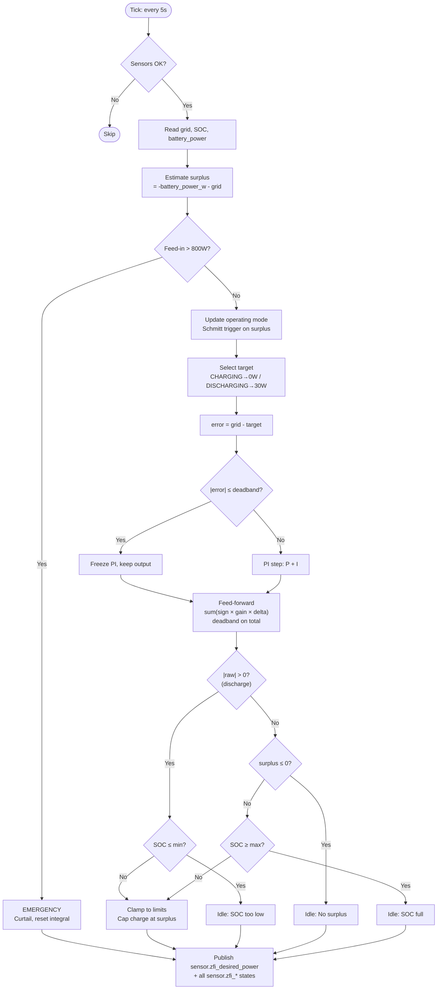
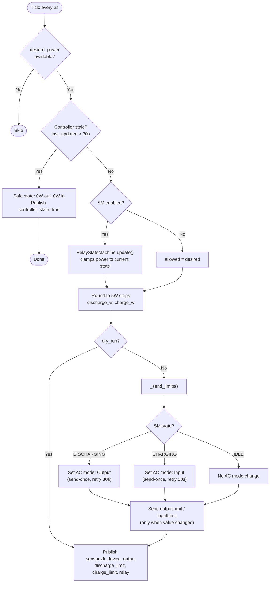
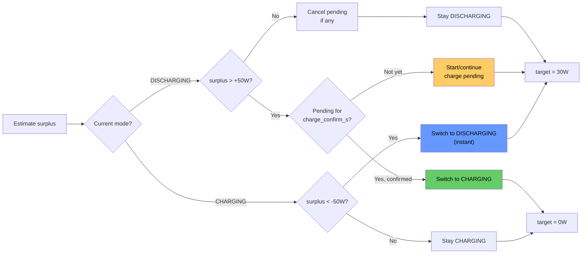

# Zero Feed-In — Documentation

## Overview

Two AppDaemon apps for the Zendure SolarFlow 2400 AC+ that keep the grid meter at ~0 W:

1. **Controller** (`zero_feed_in_controller.py`) — Device-agnostic PI controller. Reads grid power, SOC, and battery power sensors. Publishes a signed desired-power value.
2. **Driver** (`zendure_solarflow_driver.py`) — Zendure-specific driver. Reads the desired power and translates it into `outputLimit`, `inputLimit`, and `acMode` commands.

- **Solar surplus** → charge battery (absorb excess PV)
- **Solar deficit** → discharge battery (cover house demand)
- **No surplus** → **never** charge from grid

---

## System Architecture

```
┌──────────────┐                     ┌───────────────┐
│  Existing PV │───── AC ──────────▸ │   House Grid  │
│  System      │  (solar power)      │               │
└──────────────┘                     │  ┌─────────┐  │
                                     │  │  Loads  │  │
┌──────────────┐    MQTT (W)         │  └─────────┘  │
│  EDL21 IR    │───────────────────▸ │               │
│  Reader      │                     │               │◂──── Utility Grid
└──────────────┘                     └───────┬───────┘
       │                                     │ AC
       ▼                                     │
┌──────────────────────────┐        ┌────────┴────────┐
│  Home Assistant          │  MQTT  │  SolarFlow      │
│  ┌────────────────────┐  │◂─────▸│  2400 AC+       │
│  │  AppDaemon         │  │       │                  │
│  │  ┌──────────────┐  │  │       │  setOutputLimit  │
│  │  │  Controller   │──┤──┤──────▸│  setInputLimit   │
│  │  │  (PI)        │  │  │       │  acMode          │
│  │  └──────┬───────┘  │  │       └──────────────────┘
│  │         │desired_W  │  │
│  │  ┌──────▼───────┐  │  │
│  │  │  Driver      │──┘  │
│  │  │  (Zendure)   │     │
│  │  └──────────────┘     │
│  │                       │
│  │  sensor.zfi_*         │
│  │  (published states)   │
│  └───────────────────────┘
└──────────────────────────┘
```

### Data flow

```
Controller (every 5s):
  grid_power_sensor ─────────┐
  soc_sensor ────────────────┤
  battery_power_sensor───────┤──▸ PI + FF ──▸ sensor.zfi_desired_power
  ff_sources (optional)──────┤               sensor.zfi_mode, surplus, etc.
  relay_locked_sensor────────┤               (integral frozen when locked)
  dynamic_min_soc_entity ────┘               (forecast-adjusted min SOC)

Driver (every 2s):
  sensor.zfi_desired_power ──▸ AC mode + outputLimit + inputLimit
                                sensor.zfi_device_output, relay, etc.
```

### Why two apps?

| Concern | Controller | Driver |
| --- | --- | --- |
| What it knows | Grid power, SOC, surplus | Device protocol, relay timing |
| What it doesn't know | outputLimit, inputLimit, acMode | PI gains, targets, modes |
| Reusable for | Any battery | Only Zendure SolarFlow |
| Update rate | 5 s (PI cycle) | 2 s (react to new desired power) |

---

## Controller: Key Concepts

### 1. Solar Surplus Estimation

The controller uses the **actual battery power sensor** (updated every ~4 s by the device) instead of the last commanded value:

```
battery_power_sensor: +positive = discharge, -negative = charge
controller convention: +positive = discharge, -negative = charge (same)

battery_power_w = battery_power_sensor  (no negation)

surplus = -battery_power_w - grid_power_w
        = -(actual battery) - grid
```

This is more accurate than the old `last_sent_w` approach because it reflects what the device is actually doing, not what was commanded. Particularly important during the 10-15 s device response lag.

| Scenario | battery_power_w | grid | surplus |
| --- | --- | --- | --- |
| Charging 500 W, grid +100 W | -500 | +100 | 400 W |
| Discharging 300 W, grid +100 W | +300 | +100 | -400 W |
| Charging 500 W, grid -200 W | -500 | -200 | 700 W |
| Idle, grid -50 W | 0 | -50 | 50 W |

### 2. Operating Mode (Schmitt Trigger with Charge Confirmation)

```
                    surplus > +hysteresis (sustained for charge_confirm_s)
    DISCHARGING ──────────────────────────────────▸ CHARGING
                ◂──────────────────────────────────
                    surplus < -hysteresis (instant)
```

- **DISCHARGING → CHARGING**: Surplus must stay above threshold for `charge_confirm_s` (default 15–20 s). Prevents transient spikes from triggering expensive relay switches.
- **CHARGING → DISCHARGING**: Instant. Cover demand quickly.
- On mode transition: integral and last_computed_w reset to 0.

### 3. Asymmetric Targets

| Mode | Target | Rationale |
| --- | --- | --- |
| DISCHARGING | +30 W | Small grid draw OK as safety buffer |
| CHARGING | 0 W | Absorb all surplus, never pull from grid |

### 4. Surplus Clamp

```python
if raw < 0:  # wants to charge
    max_safe = max(0, surplus)
    clamped = max(raw, -max_charge, -max_safe)
```

### 5. Direction Switches

Optional `input_boolean` entities for HA UI control:

| Switch | When off |
| --- | --- |
| `charge_switch` | Controller idles instead of charging |
| `discharge_switch` | Controller idles instead of discharging |

When any guard forces the controller to idle (direction switches, SOC limits,
no-surplus protection), the **integral is reset to zero**.  The integral only
has meaning in a closed control loop; while the output is blocked (loop open),
there is no feedback, so the integral becomes stale.  Resetting ensures the PI
starts fresh when the guard clears.

---

## Controller: PI Controller + Feed-Forward

### Position Form

```
error = grid_power - target

gains = gain_set.select(mode, error)    # four-quadrant lookup
P = gains.kp × error
I = I_prev + gains.ki × error × dt

pi_output = P + I
```

NOT velocity/incremental form. Critical with the SolarFlow's 10-15 s response latency.

### Multi-Source Feed-Forward

The ``FeedForward`` class processes an arbitrary list of sensor sources.
Each source has a sign (+1 for loads, -1 for generation) and a gain.

Instead of a raw delta, the derivative is taken on an **EMA-filtered** value
(ISA PID D-filter). This attenuates high-frequency sensor noise while preserving
slow ramps that merit a feed-forward response:

```
α = interval_s / (filter_tau_s + interval_s)   # e.g. 5/(30+5) ≈ 0.14

for each source:
    EMA_t = α × current + (1−α) × EMA_{t-1}    # update filter state
    delta = α × (current − EMA_{t-1})           # filtered derivative
    contrib += sign × gain × delta

if |contrib| < ff_deadband:
    contrib = 0
combined = pi_output + contrib
```

With τ=30 s a 200 W spike produces a 28 W FF impulse — below the 30 W deadband,
so short cloud transients are ignored. Sustained slow ramps exceed the deadband
and do trigger a feed-forward response.

PV drops → positive ff (increase discharge). Load increases → positive ff.
New sources are a YAML entry, no code changes required.
Set ``ff_enabled: false`` to disable feed-forward without removing sources.

Each source can carry an optional ``name`` that is used for HA debug sensor
names (e.g. ``name: pv`` → ``sensor.zfi_ff_pv_raw``).

Example configuration:
```yaml
ff_enabled: true
ff_deadband: 30
ff_filter_tau_s: 30     # EMA time constant (s); α = interval/(tau+interval)
feed_forward_sources:
  - entity: sensor.pv_power
    gain: 0.6
    sign: -1.0          # generation
    name: pv            # → sensor.zfi_ff_pv_raw / _ema / _contrib
  - entity: sensor.wallbox_power
    gain: 0.8
    sign: 1.0           # load
```

Backward compatible: legacy ``pv_sensor`` / ``ff_pv_gain`` keys
still work and create a single FF source automatically.

### Four-Quadrant Gains

Gains are selected per cycle based on operating mode × error sign.
Derived from step response measurements (SIMC: Kp = interval / (2×T1), Ki = Kp / (4×T1)).

| Quadrant | Physical action | T1 (s) | Kp | Ki |
| --- | --- | --- | --- | --- |
| `discharge_up` | increase discharge | 5.0 | 0.50 | 0.025 |
| `discharge_down` | decrease discharge | 3.5 | 0.71 | 0.051 |
| `charge_up` | increase charge | 7.5 | 0.33 | 0.011 |
| `charge_down` | decrease charge | 5.5 | 0.45 | 0.021 |

Selection matrix:

|  | error ≥ 0 | error < 0 |
| --- | --- | --- |
| DISCHARGING | discharge_up | discharge_down |
| CHARGING | charge_down | charge_up |

### Anti-Windup (Back-Calculation)

When output hits limits, `integral = limit - P_term`. Prevents windup during saturation.

### Relay Lockout Anti-Windup

When the driver’s relay state machine is clamping output (e.g. during a relay
transition lockout), the driver publishes `sensor.zfi_relay_locked = "true"`.Additionally, `relay_locked` stays `true` for 8 seconds after each SM
transition (`RELAY_SWITCH_DELAY_S`) to account for the physical relay
switching time. This prevents the controller from winding up the integral
while the relay is physically switching and the device cannot yet actuate
the new setpoint.The controller reads this via the optional `relay_locked_sensor` config and
**freezes the integral**: no new integral is committed, and no back-calculation
is performed. The normal output pipeline still runs (P + I + FF → clamp), so
the driver sees the controller’s intent, but the integral does not wind up
while the device cannot actuate.

The reason string includes a " (relay locked)" suffix when active.

### Deadband

When |error| ≤ deadband_w: P = 0, integral frozen, output unchanged.

---

## Driver: Key Concepts

### 1. AC Mode Management

The Zendure SolarFlow requires the correct AC mode before accepting power limits:
- "Input mode" before sending `inputLimit` (charge)
- "Output mode" before sending `outputLimit` (discharge)

The driver sends the AC mode command **once** on intent change, then waits for the device. It does NOT spam the command every tick — the MQTT integration overwrites the entity with device reports faster than the relay physically switches (10-15 s).

Re-send after 30 s if the intent persists (`AC_MODE_RETRY_S`).

### 2. Power Limits

Power limits (outputLimit, inputLimit) are sent whenever their values change. No gating on device mode confirmation — the device is responsible for applying limits in the correct mode.

### 3. Relay Lockout (adaptive, energy-integrator)

The `RelayStateMachine` gates relay transitions behind an energy integrator (`AdaptiveLockout`).  Each tick accumulates `|power| × dt`; the transition fires when the accumulated energy reaches `full_power_w × base_lockout_s`.

```
threshold = full_power_w × base_lockout_s   (e.g. 200 W × 30 s = 6 000 W·s)
```

For sustained constant power the effective lockout is:

| |desired_power| | Lockout (base=30s, ref=200W) | Rationale |
| --- | --- | --- |
| 200 W+ | 30 s | High surplus — worth switching |
| 100 W | 60 s | Moderate — wait longer |
| 50 W | 120 s | Marginal — probably not worth the relay wear |
| <20 W | ≥300 s (safety cap) | Negligible — idle instead |

IDLE transitions use an accumulated-time lockout (`idle_lockout_s`): time is only counted during ticks where IDLE is the target, so oscillations between non-current states accumulate IDLE time across interruptions.

**Independent accumulators:** Each non-current state tracks its own transition progress independently. Switching between two non-current targets (e.g. oscillating between IDLE and DISCHARGE while in CHARGING) does **not** reset the other's accumulator. This ensures that even with oscillating desired power, the state machine eventually transitions — whichever accumulator reaches its threshold first wins. All accumulators are reset only when the desired state matches the current state (stable) or when an actual transition fires.

A 300 s safety timeout (`RELAY_SAFETY_TIMEOUT_S`) forces the transition if the integrator hasn't reached threshold (e.g. very low power).

During lockout, power is **clamped** to the current direction's minimum active power (`min_active_power_w`, default 25 W), keeping the device responsive while preventing relay chatter.

### 4. Rounding and Suppression

- Power rounded to 5 W steps (`ROUNDING_STEP_W`)
- Redundant sends suppressed (only send when values change)

---

## Protection Mechanisms

### 1. Emergency (Feed-in > 800 W)

Direct curtailment: output reduced by (excess + 50 W margin). Integral back-calculated to the forced value so the PI resumes smoothly.

### 2. Direction Lockout (adaptive, direction-aware)

... gates transitions behind an energy integrator (`AdaptiveLockout`): each tick accumulates `|power| × dt` until the threshold (`full_power_w × base_lockout_s`) is reached. High power → short lockout; low power → long lockout. Each non-current state tracks its own accumulator independently — switching between two non-current targets does not reset the other's progress. A 300 s safety timeout prevents infinite lockout. During lockout: power clamped to the current direction's minimum active power (`min_active_power_w`), keeping the device responsive.

### 3. SOC Protection

| Condition | Effect |
| --- | --- |
| SOC ≤ effective min_soc | Discharge blocked |
| SOC ≥ max_soc | Charge blocked |

**Dynamic min SOC (forecast-based):** When `dynamic_min_soc_entity` is configured (default: `sensor.zfi_dynamic_min_soc`, published by the PV Forecast Manager app), the controller reads it every cycle. The effective min SOC is clamped to `[Config.min_soc_pct, Config.max_soc_pct]` so it can never violate the hard limits from `apps.yaml`. When the entity is unavailable, the static `min_soc_pct` applies.

The PV Forecast Manager (`pv_forecast_manager.py`) evaluates at 06:00, 15:00, and 20:00. If the PV forecast for tomorrow (summed across all configured Forecast.Solar entities) is below 1.5 kWh:
- **06:00 (morning)**: sets `sensor.zfi_dynamic_min_soc` to **50%** — prevents daytime discharge when PV won't recharge.
- **15:00 / 20:00 (evening)**: sets it to **30%** — preserves a night buffer.

Otherwise resets to 10%. This prevents pointless deep discharge on days when PV won't deliver enough to recharge.

### 4. Grid-Charge Protection

Three layers:
1. **Mode gate**: surplus ≤ 0 → charging blocked
2. **Surplus clamp**: charge capped at available surplus
3. **Asymmetric target**: target = 0 prevents PI from requesting grid power

### 5. Controller Stale-Check (driver)

If the controller app dies but AppDaemon continues running, the driver
would perpetually act on a stale `sensor.zfi_desired_power`. The driver
checks the entity's `last_updated` timestamp on every tick:

- **Fresh** (age ≤ `controller_stale_s`, default 30 s): normal operation.
- **Stale** (age > threshold): driver sends both `outputLimit` and
  `inputLimit` to **0 W** (safe state) and publishes
  `sensor.zfi_controller_stale = true`.
- Logs a WARNING on the stale → fresh transition and vice versa.
- Set `controller_stale_s: 0` to disable the check.

### 6. MQTT Heartbeat Publishing

Both the controller and driver can publish an ISO-8601 UTC timestamp to
a configurable MQTT topic on every tick.  This enables external
monitoring by an independent device (e.g. an ESP32 fallback controller)
that watches the heartbeat topic and takes action when it goes stale.

- Controller: `heartbeat_mqtt_topic: zfi/heartbeat/controller`
- Driver: `heartbeat_mqtt_topic: zfi/heartbeat/driver`
- Omit or leave empty to disable.

### 7. Watchdog Heartbeat Monitoring

The MQTT Watchdog app (`solarflow_mqtt_watchdog.py`) can optionally
monitor a list of HA entities for staleness.  When any entity's
`last_updated` exceeds `heartbeat_stale_s` (default 60 s):

- A HA **persistent notification** is created (one per entity).
- When the entity recovers, the notification is dismissed.
- Entities to monitor are configured via `heartbeat_entities` (e.g.
  `sensor.zfi_desired_power`, `sensor.zfi_device_output`).

---

## Flowcharts

### Main Control Loop (Controller)



### Driver Loop



### Mode Selection



---

## Published HA Sensors

### Controller sensors (always published)

| Entity | Type | Unit | Description |
| --- | --- | --- | --- |
| `zfi_desired_power` | number | W | **Main output**: signed desired power (+discharge, -charge) |
| `zfi_mode` | text | — | Operating regime: `charging` or `discharging` |

### Controller sensors (debug only)

Published only when `debug: true` in the controller config.

| Entity | Type | Unit | Description |
| --- | --- | --- | --- |
| `zfi_surplus` | number | W | Estimated PV surplus |
| `zfi_battery_power` | number | W | Actual battery power (+discharge, -charge) |
| `zfi_target` | number | W | Active PI target (0 or 30) |
| `zfi_error` | number | W | Regulation error |
| `zfi_p_term` | number | W | Proportional component |
| `zfi_i_term` | number | W | Integral component |
| `zfi_ff` | number | W | Feed-forward component (post-deadband) |
| `zfi_ff_pv_raw` | number | W | Live PV sensor reading |
| `zfi_ff_pv_ema` | number | W | PV EMA filter state (τ = 30 s) |
| `zfi_ff_pv_contrib` | number | W | PV contribution before deadband |
| `zfi_ff_others_contrib` | number | W | All non-PV load sources summed, before deadband |
| `zfi_integral` | number | W | Integral accumulator |
| `zfi_reason` | text | — | Decision reason |

### Driver sensors (always published)

| Entity | Type | Unit | Description |
| --- | --- | --- | --- |
| `zfi_device_output` | number | W | Signed power sent to device |
| `zfi_discharge_limit` | number | W | outputLimit sent (≥ 0) |
| `zfi_charge_limit` | number | W | inputLimit sent (≥ 0) |
| `zfi_relay` | text | — | Physical relay state from AC mode entity |
| `zfi_relay_locked` | text | — | `true` when SM is clamping output or relay is physically switching (8 s holdoff) |
| `zfi_controller_stale` | text | — | `true` when the controller's desired-power sensor hasn't updated within `controller_stale_s` — driver sends safe state (0 W) |

### Driver sensors (debug only)

Published only when `debug: true` in the driver config.

| Entity | Type | Unit | Description |
| --- | --- | --- | --- |
| `zfi_relay_sm_state` | text | — | Current SM state (idle/charging/discharging) |
| `zfi_relay_sm_pending` | text | — | Pending transition target (or "none") |
| `zfi_relay_sm_lockout_pct` | number | % | Unified lockout progress for active transition |
| `zfi_relay_sm_accumulated_ws` | number | W·s | Accumulated energy toward transition threshold |
| `zfi_relay_sm_threshold_ws` | number | W·s | Energy threshold required for transition |
| `zfi_relay_sm_charge_pct` | number | % | Charge transition progress |
| `zfi_relay_sm_discharge_pct` | number | % | Discharge transition progress |
| `zfi_relay_sm_idle_pct` | number | % | Idle transition progress |

---

## Debug Dashboards

### Full Debug Dashboard

Shows all controller and driver states for troubleshooting. Copy to a manual HA dashboard card (YAML mode):

```yaml
type: vertical-stack
cards:
  # ── Power overview ──────────────────────────────
  - type: history-graph
    title: Power & Control
    hours_to_show: 0.5
    entities:
      - entity: sensor.smart_meter_sum_active_instantaneous_power
        name: Grid Power
      - entity: sensor.zfi_desired_power
        name: Desired Power
      - entity: sensor.zfi_device_output
        name: Device Output
      - entity: sensor.zfi_surplus
        name: Surplus
      - entity: sensor.zfi_battery_power
        name: Battery Power

  # ── Device commands ─────────────────────────────
  - type: history-graph
    title: Device Commands
    hours_to_show: 0.5
    entities:
      - entity: sensor.zfi_discharge_limit
        name: Discharge Limit
      - entity: sensor.zfi_charge_limit
        name: Charge Limit

  # ── PI internals ────────────────────────────────
  - type: history-graph
    title: PI Controller
    hours_to_show: 0.5
    entities:
      - entity: sensor.zfi_error
        name: Error
      - entity: sensor.zfi_p_term
        name: P Term
      - entity: sensor.zfi_i_term
        name: I Term
      - entity: sensor.zfi_integral
        name: Integral
      - entity: sensor.zfi_target
        name: Target

  # ── Battery ─────────────────────────────────────
  - type: history-graph
    title: Battery
    hours_to_show: 0.5
    entities:
      - entity: sensor.hec4nencn492140_electriclevel
        name: SOC %

  # ── Relay state machine ─────────────────────────
  - type: history-graph
    title: Relay State Machine
    hours_to_show: 0.5
    entities:
      - entity: sensor.zfi_relay_sm_lockout_pct
        name: Lockout Progress %
      - entity: sensor.zfi_relay_sm_accumulated_ws
        name: Accumulated (W·s)
      - entity: sensor.zfi_relay_sm_threshold_ws
        name: Threshold (W·s)

  # ── Current state (entities card) ───────────────
  - type: entities
    title: ZFI Status
    entities:
      - entity: sensor.zfi_desired_power
        name: Desired Power
      - entity: sensor.zfi_device_output
        name: Device Output
      - entity: sensor.zfi_mode
        name: Mode
      - entity: sensor.zfi_relay
        name: Relay
      - entity: sensor.zfi_relay_locked
        name: Relay Locked
      - entity: sensor.zfi_surplus
        name: Surplus
      - entity: sensor.zfi_battery_power
        name: Battery Power
      - entity: sensor.zfi_target
        name: Target
      - entity: sensor.zfi_error
        name: Error
      - entity: sensor.zfi_p_term
        name: P Term
      - entity: sensor.zfi_i_term
        name: I Term
      - entity: sensor.zfi_integral
        name: Integral
      - entity: sensor.zfi_discharge_limit
        name: Discharge Limit
      - entity: sensor.zfi_charge_limit
        name: Charge Limit
      - entity: sensor.zfi_reason
        name: Reason
      - type: divider
      - entity: sensor.zfi_relay_sm_state
        name: SM State
      - entity: sensor.zfi_relay_sm_pending
        name: SM Pending
      - entity: sensor.zfi_relay_sm_lockout_pct
        name: SM Lockout %
      - entity: sensor.zfi_relay_sm_accumulated_ws
        name: SM Accumulated (W·s)
      - entity: sensor.zfi_relay_sm_threshold_ws
        name: SM Threshold (W·s)
      - type: divider
      - entity: select.hec4nencn492140_acmode
        name: AC Mode (device)
      - entity: number.hec4nencn492140_outputlimit
        name: outputLimit (device)
      - entity: number.hec4nencn492140_inputlimit
        name: inputLimit (device)
      - entity: sensor.hec4nencn492140_electriclevel
        name: SOC (device)
      - type: divider
      - entity: input_boolean.zfi_charge_enabled
        name: Charge Enabled
      - entity: input_boolean.zfi_discharge_enabled
        name: Discharge Enabled
```

### Compact Overview Dashboard

For daily monitoring (not debugging):

```yaml
type: vertical-stack
cards:
  - type: history-graph
    title: Zero Feed-In
    hours_to_show: 0.5
    entities:
      - entity: sensor.smart_meter_sum_active_instantaneous_power
        name: Grid
      - entity: sensor.zfi_surplus
        name: Surplus
      - entity: sensor.zfi_desired_power
        name: Desired
      - entity: sensor.zfi_device_output
        name: Output

  - type: entities
    title: Status
    entities:
      - entity: sensor.zfi_mode
      - entity: sensor.zfi_reason
      - entity: sensor.zfi_relay_locked
        name: Relay Locked
      - entity: sensor.hec4nencn492140_electriclevel
        name: SOC
      - entity: input_boolean.zfi_charge_enabled
      - entity: input_boolean.zfi_discharge_enabled
```

### Relay State Machine Debug Dashboard

For diagnosing relay transitions and adaptive lockout behaviour:

```yaml
type: vertical-stack
cards:
  # ── Lockout energy integrator over time ─────────
  - type: history-graph
    title: Adaptive Lockout Progress
    hours_to_show: 0.5
    entities:
      - entity: sensor.zfi_relay_sm_lockout_pct
        name: Lockout %
      - entity: sensor.zfi_relay_sm_accumulated_ws
        name: Accumulated (W·s)
      - entity: sensor.zfi_relay_sm_threshold_ws
        name: Threshold (W·s)

  # ── Per-direction progress (independent accumulators) ─
  - type: history-graph
    title: Direction Progress (independent)
    hours_to_show: 0.5
    entities:
      - entity: sensor.zfi_relay_sm_charge_pct
        name: Charge %
      - entity: sensor.zfi_relay_sm_discharge_pct
        name: Discharge %
      - entity: sensor.zfi_relay_sm_idle_pct
        name: Idle %

  # ── AC mode & power context ────────────────────
  - type: history-graph
    title: AC Mode & Power
    hours_to_show: 0.5
    entities:
      - entity: select.hec4nencn492140_acmode
        name: AC Mode (device)
      - entity: sensor.zfi_relay
        name: Relay (driver)
      - entity: sensor.zfi_relay_locked
        name: Relay Locked
      - entity: sensor.zfi_desired_power
        name: Desired Power
      - entity: sensor.zfi_discharge_limit
        name: Discharge Sent
      - entity: sensor.zfi_charge_limit
        name: Charge Sent

  # ── Current SM state ───────────────────────────
  - type: entities
    title: Relay State Machine
    entities:
      - entity: sensor.zfi_relay_sm_state
        name: Current State
      - entity: sensor.zfi_relay_sm_pending
        name: Last Target
      - entity: sensor.zfi_relay_sm_lockout_pct
        name: Last Target Lockout %
      - entity: sensor.zfi_relay_sm_accumulated_ws
        name: Accumulated Energy (W·s)
      - entity: sensor.zfi_relay_sm_threshold_ws
        name: Threshold (W·s)
      - type: divider
      - entity: sensor.zfi_relay_sm_charge_pct
        name: Charge Progress %
      - entity: sensor.zfi_relay_sm_discharge_pct
        name: Discharge Progress %
      - entity: sensor.zfi_relay_sm_idle_pct
        name: Idle Progress %
      - type: divider
      - entity: select.hec4nencn492140_acmode
        name: AC Mode (device)
      - entity: sensor.zfi_relay
        name: Relay (driver)
      - entity: sensor.zfi_relay_locked
        name: Relay Locked
      - entity: sensor.zfi_desired_power
        name: Desired Power
      - entity: sensor.zfi_device_output
        name: Device Output
```

---

## Installation

### 1. Install AppDaemon

Settings → Add-ons → Add-on Store → AppDaemon → Install → Start

### 2. Clone the Repository

```bash
cd /root/addon_configs/a0d7b954_appdaemon/apps
git clone https://github.com/steffenruehl/ha-zero-feed-in.git zero_feed_in
```

### 3. Configure

```bash
cp zero_feed_in/config/apps.yaml.example zero_feed_in/config/apps.yaml
```

Edit `zero_feed_in/config/apps.yaml` — fill in the **MANDATORY** sections for each app:

| apps.yaml key | App | Typical HA entity |
| --- | --- | --- |
| `grid_power_sensor` | Controller | `sensor.smart_meter_*` |
| `soc_sensor` | Controller | `sensor.*_electriclevel` |
| `battery_power_sensor` | Controller | `sensor.*_net_power` (template or helper) |
| `desired_power_sensor` | Driver | `sensor.zfi_desired_power` (from controller) |
| `output_limit_entity` | Driver | `number.*_outputlimit` |
| `input_limit_entity` | Driver | `number.*_inputlimit` |
| `ac_mode_entity` | Driver | `select.*_acmode` |
| `smart_mode_entity` | Driver | `switch.*_smartmode` (optional — enables RAM-only writes) |
| `forecast_entities` | Forecast | `sensor.energy_production_tomorrow*` |
| `watch_entity` | Watchdog | `sensor.*_electriclevel` |

Optional switches (create as HA helpers → Toggle):

| apps.yaml key | HA entity |
| --- | --- |
| `charge_switch` | `input_boolean.zfi_charge_enabled` |
| `discharge_switch` | `input_boolean.zfi_discharge_enabled` |

Add secrets to your AppDaemon `secrets.yaml` (see `config/secrets.yaml.example`).

### 4. Runtime Files

State files (PI integral, relay SM state, relay switch count) are stored in `zero_feed_in/run/`.  This directory is auto-created on first start and git-ignored, so `git pull` never overwrites runtime state.

### 5. Start in Dry Run

Set `dry_run: true` (the YAML anchor at the top of `apps.yaml` applies to all apps). Set `debug: true` to publish internal sensors for the debug dashboards. Monitor via AppDaemon log and `sensor.zfi_*` entities.

### 6. Go Live

Set `dry_run: false`. Start with `max_output: 200`. Once stable, set `debug: false` to reduce HA sensor churn.

### 7. Updating

```bash
cd /root/addon_configs/a0d7b954_appdaemon/apps/zero_feed_in
git pull origin main
```

AppDaemon detects file changes and reloads automatically.  State in `run/` is preserved across updates.

---

## Example Scenarios

### 1. Sunny day — charging from surplus

```
PV=1200W, house=500W, battery charging 400W
battery_sensor = -400 (charging → negative per convention)
battery_power_w = -400 (signed mode, no transformation)
grid = house - PV + charge = 500 - 1200 + 400 = -300W (feeding in)

surplus = -battery_power_w - grid = -(-400) - (-300) = 400 + 300 = 700W
mode: 700 > 50 → CHARGING, target = 0W
error = -300 - 0 = -300W
PI increases charge
clamp: cap at surplus=700 → charge up to 700W
→ desired_power ≈ -650W
→ driver: inputLimit=650W, outputLimit=0W
```

### 2. Cloud passes — reduce charging

```
PV drops to 600W, house=500W, battery charging 650W
battery_sensor = -650, battery_power_w = -650
grid = 500 - 600 + 650 = +550W (drawing from grid!)

surplus = -(-650) - 550 = 650 - 550 = 100W
mode: 100 > -50 → stays CHARGING (hysteresis!), target = 0W
error = 550 - 0 = 550
PI reduces charge significantly
clamp: cap at surplus=100W
→ desired_power ≈ -100W
→ driver: inputLimit=100W
```

### 3. Evening — discharge to cover load

```
PV=0W, house=400W, battery idle
battery_sensor = 0, battery_power_w = 0
grid = +400W

surplus = 0 - 400 = -400W
mode: -400 < -50 → DISCHARGING, target = 30W
error = 400 - 30 = 370
PI increases discharge
→ desired_power ≈ +370W
→ driver: outputLimit=370W, inputLimit=0W
```

### 4. Battery discharging, load drops

```
PV=0W, house=100W, battery discharging 300W
battery_sensor = +300, battery_power_w = +300
grid = 100 - 0 - 300 = -200W (feeding in!)

surplus = -(+300) - (-200) = -300 + 200 = -100W
mode: stays DISCHARGING, PI reduces output
→ desired_power drops toward 100W
```

### 5. Emergency — feed-in exceeds 800W

```
grid = -1100W (1100W flowing to grid)
feed_in = 1100 > 800 → EMERGENCY
excess = 1100 - 800 = 300
forced = current_output - 300 - 50 (safety margin)
integral → forced (back-calculated)
```

### 6. Battery full — surplus goes to grid

```
SOC=85%, surplus=500W, mode=CHARGING
PI wants to charge → guard: SOC ≥ max → idle
→ desired_power = 0W
→ Surplus flows to grid (unavoidable)
```

| Problem | Action |
| --- | --- |
| Output oscillates | Reduce Kp for the relevant quadrant, increase deadband |
| Persistent offset | Increase Ki for the relevant quadrant |
| Sluggish on load changes | Increase Kp for the relevant quadrant, reduce interval |
| Relay clicks frequently | Increase direction_lockout (30+ s), lower adaptive_lockout_ref_w (100 W), increase deadband |
| Mode flaps | Increase mode_hysteresis (80–100 W), increase charge_confirm (25 s) |
| Relay switches on marginal surplus | Lower adaptive_lockout_ref_w, increase adaptive_lockout_max_mult |
| Charges from grid briefly | Check surplus in logs, increase hysteresis |

---

## Known Limitations

- **Device response time**: 10–15 s (not 2–4 s as Zendure docs suggest)
- **Flash writes**: `setOutputLimit`/`setInputLimit` write to device flash by
  default.  Mitigated by enabling `smartMode` via `smart_mode_entity` config —
  routes all writes to RAM.  The driver re-enables smartMode automatically
  after device reboot.
- **Single phase**: SolarFlow feeds one phase; three-phase balancing at meter works
- **Single instance only**: no multi-device HEMS support
