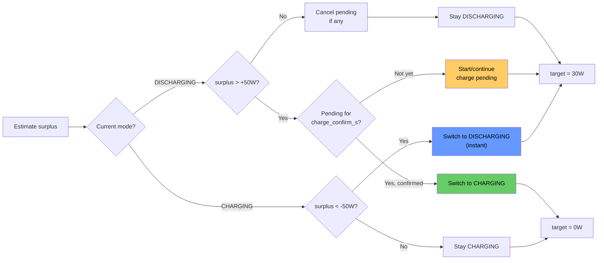

# Zero Feed-In Controller — Documentation

## Overview

AppDaemon app for the Zendure SolarFlow 2400 AC+. Keeps the grid meter at ~0 W by charging and discharging the battery based on solar surplus.

- **Solar surplus** → charge battery (absorb excess PV)
- **Solar deficit** → discharge battery (cover house demand)
- **No surplus** → **never** charge from grid

---

## System Architecture

```
┌──────────────┐                     ┌───────────────┐
│  Existing PV │───── AC ──────────▸ │   House Grid  │
│  System      │  (solar power)      │               │
└──────────────┘                     │  ┌─────────┐  │
                                     │  │  Loads  │  │
┌──────────────┐    MQTT (W)         │  └─────────┘  │
│  EDL21 IR    │───────────────────▸ │               │
│  Reader      │                     │               │◂──── Utility Grid
└──────────────┘                     └───────┬───────┘
       │                                     │ AC
       ▼                                     │
┌──────────────────────────┐        ┌────────┴────────┐
│  Home Assistant          │  MQTT  │  SolarFlow      │
│  ┌────────────────────┐  │◂─────▸│  2400 AC+       │
│  │  AppDaemon         │  │       │                  │
│  │  ZeroFeedIn        │  │       │  setOutputLimit  │
│  └────────────────────┘  │       │  setInputLimit   │
│                          │       └──────────────────┘
│  sensor.zfi_*            │
│  (published internals)   │
└──────────────────────────┘
```

Three actuators controlled by the app:

| Entity | Direction | When active |
|---|---|---|
| `setOutputLimit` | Discharge → house | Solar deficit |
| `setInputLimit` | Charge ← AC | Solar surplus |
| `acMode` | Relay direction | Before any nonzero power command |

The AC mode select entity (`select.*_acmode`) must be set to
"Output mode" before discharging and "Input mode" before charging.
The controller reads the current AC mode directly from the HA entity
and only sends a change when the direction actually differs.

Optionally, two `input_boolean` switches can be configured to
enable/disable charging and discharging from the HA UI:

| Switch | Effect when off |
|---|---|
| `charge_switch` | Controller idles instead of charging |
| `discharge_switch` | Controller idles instead of discharging |

Both are optional — omit them to always allow both directions.

---

## Key Concepts

### 1. Solar Surplus Estimation

The grid meter alone doesn't tell us how much PV is available — it only
shows the net result after the SolarFlow is already acting. To reconstruct
the actual solar surplus:

```
grid_power = house_load - pv + sf_charge - sf_discharge
           = house_load - pv - sf_signed

surplus = pv - house_load = -sf_signed - grid_power
        = -last_limit - grid_power
```

| Scenario | last_limit | grid | surplus | Interpretation |
|---|---|---|---|---|
| Charging 500W, grid +100W | -500 | +100 | 400W | PV covers most, reduce charge slightly |
| Discharging 300W, grid +100W | +300 | +100 | -400W | PV insufficient, keep discharging |
| Charging 500W, grid -200W | -500 | -200 | 700W | Plenty of solar |
| Idle, grid -50W | 0 | -50 | 50W | Small surplus |

`grid_power > 0` does **not** mean "discharge needed" — it can also mean
"charge too aggressively." Only surplus tells the full story.

### 2. Operating Mode (Schmitt Trigger with Charge Confirmation)

A state machine with hysteresis prevents mode flapping when surplus
oscillates near zero (e.g. passing clouds).

```
                    surplus > +hysteresis (sustained for charge_confirm_s)
    DISCHARGING ──────────────────────────────────▸ CHARGING
                ◂──────────────────────────────────
                    surplus < -hysteresis (instant)
```

Within the hysteresis band, the current mode persists. Default: ±50 W.

**Asymmetric transition timing:**
- **DISCHARGING → CHARGING**: Surplus must stay above the hysteresis
  threshold for `charge_confirm_s` (default 15s) continuously.
  Transient surplus spikes (e.g. a large load turning off mid-discharge)
  are ignored — they would cause an expensive relay switch for nothing.
- **CHARGING → DISCHARGING**: Instant. When you need power, you need it now.

On mode transition, the integral and last_computed_w are reset to 0.

Mode determines the PI target — nothing else. The PI controller, guards,
and clamps operate identically regardless of mode.

### 3. Asymmetric Targets

| Mode | Target | Rationale |
|---|---|---|
| DISCHARGING | +30 W | Small grid draw OK as safety buffer |
| CHARGING | 0 W | Absorb all surplus, waste nothing to grid |

Why asymmetric? With target=30 W during charging, the PI would try to
maintain +30 W grid draw — effectively pulling 30 W from the grid to
charge. Target=0 prevents this.

### 4. Surplus Clamp

Even with the correct target, the PI can overshoot on the first cycle.
The surplus clamp caps charge power at the estimated solar surplus:

```python
if raw < 0:  # wants to charge
    max_safe = max(0, surplus)
    clamped = max(raw, -max_charge, -max_safe)
```

This is a safety net, not the primary control — the PI converges correctly
via the asymmetric target.

---

## Operating Mode vs Relay Direction

Two separate concepts, often confused:

| | Operating Mode | Relay Direction |
|---|---|---|
| What | Strategic regime | Physical relay state |
| Values | CHARGING, DISCHARGING | CHARGE, IDLE, DISCHARGE |
| Driven by | Schmitt trigger on surplus | Actual AC mode entity |
| Anti-flap | Hysteresis band (±50 W) + charge confirmation (15 s) | Time lockout (5 s) |
| Purpose | Target selection | Relay protection |

The relay direction is always read from the `ac_mode_entity` in Home
Assistant — no internal tracking that could drift out of sync. The
controller only sends AC mode changes when the desired direction
differs from the entity's current state, and when output is IDLE (0W)
the AC mode is left unchanged to avoid unnecessary relay clicks.

The relay can be IDLE while mode is CHARGING (e.g. during direction
lockout or deadband). They are intentionally decoupled.

---

## PI Controller

### Position Form

The PI uses **position form** (not velocity/incremental form):

```
error = grid_power - target

P = Kp × error
I = I_prev + Ki × error × dt

output = P + I
```

The proportional term responds directly to the current error, not
accumulatively. This is critical with the SolarFlow's 10-15s response
latency — velocity form would double-integrate and cause massive
overshoot.

### Asymmetric Gains

The PI uses separate gains for ramping up vs ramping down:

| Direction | Error | Kp | Ki | Rationale |
|---|---|---|---|---|
| Ramp up (grid drawing) | > 0 | `kp_up` (0.3) | `ki_up` (0.03) | Cautious — avoid overshooting into feed-in |
| Ramp down (feeding in) | < 0 | `kp_down` (0.8) | `ki_down` (0.08) | Aggressive — cut power fast, battery energy is precious |

This asymmetry reflects the core philosophy: it's much worse to waste
battery by feeding into the grid than to temporarily draw a little
from the grid.

### Anti-Windup (Back-Calculation)

When the PI output hits the clamp limits (±max_discharge_w / ±max_charge_w),
the integral is back-calculated so that `integral = limit - P_term`.
This prevents the integral from winding up while the output is saturated.
When the situation changes, the integral is already at a sane value
instead of being bloated from accumulated error during saturation.

### Deadband

When |error| ≤ deadband_w: P = 0, integral frozen, output unchanged.
Prevents micro-corrections and reduces MQTT traffic.

### Recommended Starting Values

| Parameter | Value | Rationale |
|---|---|---|
| kp_up | 0.3 | Cautious ramp-up to prevent overshoot |
| kp_down | 0.8 | Aggressive cut to protect battery energy |
| ki_up | 0.03 | Slow integral for ramp-up |
| ki_down | 0.08 | Fast integral for ramp-down |
| deadband | 25 W | Prevents micro-corrections |
| discharge target | 30 W | Small safety buffer |
| charge target | 0 W | Absorb all surplus |
| hysteresis | 50 W | Stable mode transitions |
| charge_confirm | 15 s | Prevent transient mode switches |
| interval | 5 s | Fast enough, manageable MQTT load |

---

## Protection Mechanisms

### 1. Emergency (Feed-in > 800 W)

| Action | Detail |
|---|---|
| Direct curtailment | Output reduced by (excess + 50 W margin) |
| Integral reset | Prevents overshoot on recovery |

### 2. Direction Lockout (5 s)

Three relay states: CHARGE, IDLE, DISCHARGE. Switching between any two
requires the lockout period to have elapsed. Prevents relay chatter.
Emergency overrides the lockout.

During lockout, the integral is frozen to prevent windup while the
device is transitioning AC mode and can't respond.

The lockout timer is reset only when `_set_ac_mode()` actually sends
a mode change to the device.

### 3. SOC Protection

| Condition | Effect |
|---|---|
| SOC ≤ min_soc (10%) | Discharge blocked |
| SOC ≥ max_soc (100%) | Charge blocked |

### 4. Grid-Charge Protection

If surplus ≤ 0 and PI wants to charge → blocked. Charging would draw
from the grid. This is the core safety rule.

### 5. Direction Switches

Optional `input_boolean` entities (`charge_switch`, `discharge_switch`)
allow enabling/disabling each direction from the HA UI. When a switch
is off and the controller would want to act in that direction, it idles
instead. The PI continues computing normally — only the output is
suppressed. This lets users manually pause charging (e.g. to reserve
battery for evening) or discharging (e.g. during low-tariff hours)
without stopping the controller.

### 6. Surplus Clamp

Charge power capped at estimated solar surplus. Even if the PI
overshoots, the device never receives more than what solar provides.

---

## Flowchart — Main Control Loop

```mermaid
flowchart TD
    A([Tick: every 5s]) --> B{Sensors OK?}
    B -- No --> Z([Skip])
    B -- Yes --> C[Read grid, SOC, output limit]

    C --> D[Estimate surplus<br>= -last_limit - grid]

    D --> E{Feed-in > 800W?}
    E -- Yes --> F["EMERGENCY<br>Curtail aggressively<br>Reset integral"]
    F --> PUB

    E -- No --> G[Update operating mode<br>Schmitt trigger on surplus]
    G --> H[Select target<br>CHARGING→0W / DISCHARGING→30W]
    H --> I["error = grid - target"]

    I --> J{|error| ≤ deadband?}
    J -- Yes --> K[Freeze PI, keep current limit]
    J -- No --> L[PI step: P + I<br>asymmetric gains]

    K --> M
    L --> M[output = Kp*error + integral]

    M --> N{raw > 0?}
    N -- Yes --> O{SOC ≤ min?}
    O -- Yes --> P["Idle: SOC too low"]
    O -- No --> Q[Discharge path]

    N -- No --> R{surplus ≤ 0?}
    R -- Yes --> S["Idle: No surplus"]
    R -- No --> T{SOC ≥ max?}
    T -- Yes --> U["Idle: SOC full"]
    T -- No --> V[Charge path]

    Q --> W{Relay direction changed?}
    V --> W
    W -- Yes --> X{"≥ lockout_s?"}
    X -- No --> Y["Keep last limit"]
    X -- Yes --> CL
    W -- No --> CL

    CL[Clamp to limits<br>Anti-windup back-calc<br>Cap charge at surplus<br>Round to 10W step]

    CL --> PUB
    P --> PUB
    S --> PUB
    U --> PUB
    Y --> PUB

    PUB[Update state<br>Publish HA sensors<br>Log]

    PUB --> DRY{Dry run?}
    DRY -- Yes --> Z
    DRY -- No --> ACM[Set AC mode<br>if direction changed]
    ACM --> SET[Send setOutputLimit<br>Send setInputLimit<br>only if values changed]
    SET --> Z
```

---

## Flowchart — Mode Selection



---

## Example Scenarios

### 1. Sunny day — charging from surplus

```
PV=1200W, house=500W, last_limit=-400W (charging 400W)
grid = 500 - 1200 + 400 = -300W

surplus = 400 + 300 = 700W
mode: surplus 700 > 50 → CHARGING, target = 0W
error = -300 - 0 = -300
PI increases charge
clamp: min(charge, surplus=700) → charge up to 700W
→ setOutputLimit=0, setInputLimit≈650W
```

### 2. Cloud passes — reduce charging (grid goes positive)

```
PV drops to 600W, house=500W, last_limit=-650W (charging 650W)
grid = 500 - 600 + 650 = +550W

surplus = 650 - 550 = 100W
mode: 100 > -50 → stays CHARGING (hysteresis!), target = 0W
error = 550 - 0 = 550
PI reduces charge significantly
clamp: cap at surplus=100W
→ setOutputLimit=0, setInputLimit=100W
```

Note: grid is +550W but mode stays CHARGING. Without the Schmitt trigger,
this would flip to DISCHARGING with target=30W — completely wrong.

### 3. Evening — discharge to cover load

```
PV=0W, house=400W, last_limit=0W (idle)
grid = +400W

surplus = 0 - 400 = -400W
mode: -400 < -50 → DISCHARGING, target = 30W
error = 400 - 30 = 370
PI increases discharge
→ setOutputLimit=370W, setInputLimit=0W
```

### 4. Night — small base load

```
PV=0W, house=80W, last_limit=-50W (was charging)
grid = +130W

surplus = 50 - 130 = -80W
mode: -80 < -50 → DISCHARGING, target = 30W
error = 130 - 30 = 100
PI starts discharging
→ setOutputLimit≈100W, setInputLimit=0W
```

### 5. Overcast — minimal PV, currently idle

```
PV=220W, house=200W, last_limit=0W
grid = -20W

surplus = 0 + 20 = 20W
mode: 20 < 50 → stays DISCHARGING (hysteresis), target = 30W
error = -20 - 30 = -50 → PI wants to reduce output
output already at 0 → nothing to reduce
→ 20W goes to grid (acceptable, below hysteresis threshold)
```

When PV rises to 280W → surplus = 80W → mode switches to CHARGING →
target becomes 0W → charges with ~80W.

### 6. Emergency — feed-in exceeds 800 W

```
grid = -1100W (1100W flowing to grid)
feed_in = 1100 > 800 → EMERGENCY
excess = 1100 - 800 = 300
forced = current_output - 300 - 50 (safety margin)
integral → 0
→ Output aggressively reduced, relay lockout bypassed
```

### 7. Battery full — surplus goes to grid

```
SOC=100%, surplus=500W, mode=CHARGING
PI wants to charge → guard: SOC ≥ max → idle
→ setOutputLimit=0, setInputLimit=0
→ Surplus flows to grid (unavoidable)
```

---

## Published HA Sensors

All sensors are created automatically under the configurable prefix
(default `sensor.zfi_`). Updated every control cycle.

| Entity | Type | Unit | Description |
|---|---|---|---|
| `zfi_mode` | text | — | Operating regime: `charging` or `discharging` |
| `zfi_relay` | text | — | Physical relay: `charge`, `idle`, `discharge` |
| `zfi_surplus` | number | W | Estimated PV surplus (pv - house_load) |
| `zfi_target` | number | W | Active PI target (0 or 30) |
| `zfi_error` | number | W | Current regulation error |
| `zfi_p_term` | number | W | Proportional component |
| `zfi_i_term` | number | W | Integral component |
| `zfi_integral` | number | W | Integral accumulator |
| `zfi_discharge_limit` | number | W | Discharge command sent to device |
| `zfi_charge_limit` | number | W | Charge command sent to device |
| `zfi_reason` | text | — | Human-readable decision reason |

Numeric sensors have `state_class: measurement` and are directly
usable in history graphs and the energy dashboard.

### Dashboard Example

**History graph** (shows control behavior over time):

```yaml
type: history-graph
title: Zero Feed-In Controller
hours_to_show: 4
entities:
  - entity: sensor.edl21_power
    name: Grid
  - entity: sensor.zfi_surplus
    name: Surplus
  - entity: sensor.zfi_discharge_limit
    name: Discharge
  - entity: sensor.zfi_charge_limit
    name: Charge
  - entity: sensor.zfi_integral
    name: Integral
```

**Status card** (current state at a glance):

```yaml
type: entities
title: ZFI Status
entities:
  - entity: sensor.zfi_mode
  - entity: sensor.zfi_relay
  - entity: sensor.zfi_surplus
  - entity: sensor.zfi_target
  - entity: sensor.zfi_error
  - entity: sensor.zfi_reason
  - entity: input_boolean.zfi_charge_enabled
  - entity: input_boolean.zfi_discharge_enabled
```

---

## Installation

### 1. Install AppDaemon

Settings → Add-ons → Add-on Store → AppDaemon → Install → Start

### 2. Deploy Files

```
config/appdaemon/apps/
  ├── zero_feed_in.py
  └── apps.yaml
```

### 3. Configure Entity Names

Open **MQTT Explorer**, connect to your broker, and find the actual
entity names created by the SolarFlow MQTT autodetect. Map them in
`apps.yaml`:

| apps.yaml key | Typical HA entity |
|---|---|
| `grid_power_sensor` | `sensor.edl21_power` |
| `solarflow_output_sensor` | `sensor.*_outputhomepower` |
| `solarflow_soc_sensor` | `sensor.*_electriclevel` |
| `output_limit_entity` | `number.*_outputlimit` |
| `input_limit_entity` | `number.*_inputlimit` |
| `ac_mode_entity` | `select.*_acmode` |

Optionally, create two `input_boolean` helpers in HA
(Settings → Devices → Helpers → Toggle) and add them:

| apps.yaml key | HA entity |
|---|---|
| `charge_switch` | `input_boolean.zfi_charge_enabled` |
| `discharge_switch` | `input_boolean.zfi_discharge_enabled` |

### 4. Start in Dry Run

Default `dry_run: true` — the controller computes everything, publishes
HA sensors and logs, but sends no commands to the SolarFlow.

Monitor via AppDaemon log (Add-on → Log tab) and the published
`sensor.zfi_*` entities.

### 5. Go Live

Set `dry_run: false` in `apps.yaml`, restart AppDaemon. Start with
`max_output: 200` and increase over several days.

---

## Testing Strategy

### Dry Run with Manual Output

1. Set `dry_run: true`
2. Manually set the SolarFlow output via the app or HA Developer Tools
3. Watch `sensor.zfi_*` — the controller shows what it *would* do
4. Compare your manual choices with the controller's proposals

The controller sees real physics (your manual output changes grid_power),
so the PI, surplus, and mode all react truthfully.

### Ramp-Up Schedule

```
Day 1:  dry_run: true, observe logs and zfi sensors
Day 2:  dry_run: false, max_output: 200
Day 3:  max_output: 400
Day 4:  max_output: 600
Day 5:  max_output: 800, tune Kp/Ki
```

---

## Tuning

| Problem | Action |
|---|---|
| Output oscillates | Reduce kp (try 0.3), increase deadband |
| Persistent offset | Increase ki (try 0.08) |
| Sluggish on load changes | Increase kp (try 0.7), reduce interval |
| Relay clicks frequently | Increase direction_lockout (10s), increase deadband |
| Feed-in briefly exceeds 800W | Increase emergency_kp_multiplier (6.0) |
| Mode flaps (charge↔discharge) | Increase mode_hysteresis (80-100W) |
| Charges from grid briefly | Check surplus estimation in logs, increase hysteresis |

---

## Known Limitations

- **Single phase**: SolarFlow feeds on one phase. Three-phase balancing
  at the meter works, but physical phase load may be uneven.
- **Flash writes**: `setOutputLimit` / `setInputLimit` may write to
  device flash. If `setDeviceAutomationInOutLimit` is available (single
  bidirectional entity, negative = charge), adapting to it would be
  preferable.
- **No D-term**: A PID controller would react faster to induction hob
  spikes. PI is sufficient for most households.
- **Response time**: SolarFlow needs ~1-3s to react. Effective control
  interval is 6-8s (5s tick + device latency).
- **Surplus estimation**: Based on `last_limit` (what we last commanded),
  not on measured device output. If the device doesn't follow the command
  exactly, surplus estimate will drift slightly.
